# Symphony 技术方案深度分析

> 本文档是 Symphony 工程技术方案的完整分析，涵盖基础概念、项目背景、技术栈、系统架构、Agent 核心设计（Memory / Loop / Rules）、Prompt 与工作流、可观测性，以及一个 10 个 Issue 的实战调度场景。

---

## 目录

- [前置：基础概念解释](#前置基础概念解释)
- [第一章：项目概述与背景](#第一章项目概述与背景)
- [第二章：技术栈详解](#第二章技术栈详解)
- [第三章：系统架构设计](#第三章系统架构设计)
- [第四章：Agent Memory 设计](#第四章agent-memory-设计)
- [第五章：Agent Loop 循环机制](#第五章agent-loop-循环机制)
- [第六章：Agent Rules 规则体系](#第六章agent-rules-规则体系)
- [第七章：Prompt 构建与 WORKFLOW.md](#第七章prompt-构建与-workflowmd)
- [第八章：可观测性设计](#第八章可观测性设计)
- [附录一：实战场景 — 10 个 Issue 的调度过程](#附录实战场景--10-个-issue-的调度过程)
- [附录二：Symphony Agent Protocol 详解 — JSON-RPC 协议设计](#附录二symphony-agent-protocol-详解--json-rpc-协议设计)
- [附录三：实战设计案例 — shadowfolk 工作区管理系统的多 Agent 协作](#附录三实战设计案例--shadowfolk-工作区管理系统的多-agent-协作)

---

# 前置：基础概念解释

在深入技术方案之前，先解释 Symphony 中的核心术语和命名含义。

## Symphony（交响曲）

**Symphony** 的字面意思是"交响曲"——一部由多个乐器、多个声部协同演奏的大型音乐作品。这个命名是一个精妙的隐喻：

| 交响曲世界 | Symphony 系统 |
|-----------|--------------|
| 指挥家（Conductor） | **Orchestrator**（编排器） |
| 乐手（Musicians） | **Agent Workers**（编码 Agent） |
| 乐谱（Score） | **WORKFLOW.md**（工作流定义） |
| 乐章/段落（Movements） | **Issue**（任务单元） |
| 排练回合（Rehearsal rounds） | **Turn**（对话轮次） |
| 整场演出 | 一个完整的 Issue 生命周期 |

就像一场交响曲需要指挥家统一调度各个乐手，Symphony 系统通过 Orchestrator 统一调度多个 Agent 并发工作，让它们各自独立、互不干扰地完成任务。

## Orchestrator（编排器 / 指挥家）

**Orchestrator** 是 Symphony 的核心调度组件，对应交响乐中的"指挥家"。

它的职责：
- **轮询发现**：定期从 Issue Tracker（如 Linear）获取待办任务
- **智能调度**：决定哪些任务可以执行、按什么优先级、分配给哪个 Agent
- **状态协调**：监控所有运行中的 Agent，检测停滞、处理退出、安排重试
- **并发控制**：确保不超过最大并发数，按状态分配资源

它**不做**的事：不直接写代码、不修改 Issue、不提交 PR——这些都由 Agent 自己完成。

## Turn（轮次 / 回合）

**Turn** 是 Agent 与 LLM（大语言模型）之间的**一次完整对话交互**，可以理解为"一个回合"：

```
Turn 1: Symphony 发送完整的任务描述 → Codex Agent 执行一轮工作 → 返回结果
Turn 2: Symphony 发送续跑指导 → Codex Agent 继续工作 → 返回结果
Turn 3: Symphony 发送续跑指导 → Codex Agent 继续工作 → 返回结果
...
```

**为什么需要多个 Turn？**
- 一个复杂任务可能一个 Turn 完不成（LLM 有上下文长度和执行时间限制）
- 每个 Turn 结束后，Symphony 会检查 Issue 是否已完成
- 如果未完成，就发送续跑指导让 Agent 继续
- 默认最多 20 个 Turn（`agent.max_turns`）

## Session（会话）

**Session** 是一次完整的 Agent Worker 运行，从启动 Codex 子进程到关闭。一个 Session 内可以包含多个 Turn。Session 之间通过 Workspace（文件系统）保持工作连续性。

```
Issue（任务）
  └── Session 1（首次运行）
  │     ├── Turn 1（首轮：完整 prompt）
  │     ├── Turn 2（续跑：continuation guidance）
  │     └── Turn 3 ... 最多 max_turns 轮
  └── Session 2（续跑会话，上一个 session 达到 max_turns 后自动开启）
        ├── Turn 1（新的完整 prompt，但 Workspace 文件还在）
        └── ...
```

## Workspace（工作空间）

每个 Issue 的**独立工作目录**。Agent 在其中执行所有操作（clone 代码、修改文件、运行测试等）。关键特性：**隔离性**（Agent 之间互不干扰）、**持久性**（跨 Session 保留）、**安全性**（不能逃逸到其他目录）。

## Dispatch（调度）

Orchestrator 将一个 Issue 分配给一个 Agent Worker 执行的动作。Dispatch 之前会执行一系列严格的准入检查。

## Reconciliation（协调 / 对账）

Orchestrator 定期检查所有运行中的 Agent 并与 Issue Tracker 对账的过程，确保停滞的 Agent 被重启、状态变化后 Agent 相应停止或继续。

## Claim（认领）

内存中的标记，表示"这个 Issue 已被认领"。在 dispatch 到执行之间、以及重试等待期间，Claim 防止同一个 Issue 被重复调度。

---

# 第一章：项目概述与背景

## 一、项目定位

**Symphony** 是 [OpenAI](https://github.com/openai/symphony) 开源的一个**自主编码 Agent 调度服务**（Autonomous Coding Agent Orchestrator）。它的核心目标是：

> **将项目工作（project work）转化为隔离的、自主的实现运行（implementation runs），让团队管理工作本身，而非监督编码 Agent。**

Symphony 是一个长期运行的自动化守护服务，它持续从 Issue Tracker（如 Linear）读取待办工作，为每个 issue 创建隔离的工作空间（workspace），然后在该工作空间中运行编码 Agent（如 OpenAI Codex）来自主完成任务。

## 二、解决的问题

Symphony 解决四个运维层面的核心问题：

| # | 问题 | Symphony 的解法 |
|---|------|----------------|
| 1 | 手动脚本执行 issue 不可重复 | 将 issue 执行变成**可重复的守护进程工作流** |
| 2 | Agent 并发执行时互相干扰 | 在**每个 issue 独立的 workspace** 中隔离 agent 执行 |
| 3 | 工作流策略分散、不可追溯 | 将工作流策略存放于仓库中的 `WORKFLOW.md`，让团队**将 Agent prompt 和运行时设置版本化管理** |
| 4 | 多个并发 Agent 运行难以监控和调试 | 提供足够的**可观测性**以运维和调试多个并发 Agent 运行 |

## 三、设计边界

Symphony 有明确的**角色边界**：

- **Symphony 是什么**：调度器/运行器（scheduler/runner）和 Tracker 读取器（tracker reader）
- **Symphony 不做什么**：不直接写入 Ticket（状态转换、评论、PR 链接等由编码 Agent 通过工具完成）

一个成功的运行可能终止在工作流定义的**交接状态**（如 `Human Review`），而不一定是 `Done`。

## 四、设计目标

### 4.1 Goals

- 以固定节奏轮询 Issue Tracker 并以有界并发调度工作
- 维护单一权威的编排器状态，用于调度、重试和协调
- 创建确定性的 per-issue workspace 并跨运行复用
- 当 issue 状态变化使其不再符合条件时停止活跃运行
- 通过指数退避从暂时性故障中恢复
- 从仓库中的 `WORKFLOW.md` 加载运行时行为
- 暴露操作员可见的可观测性（至少包括结构化日志）
- 支持无需持久化数据库的重启恢复

### 4.2 Non-Goals

- 丰富的 Web UI 或多租户控制平面
- 通用工作流引擎或分布式作业调度器
- 内建的 Ticket 编辑、PR 或评论的业务逻辑
- 强制要求特定的沙箱控制或审批策略

## 五、项目结构

```
symphony/
├── SPEC.md                    # 语言无关的服务规范（2111行）
├── README.md                  # 项目入口文档
├── LICENSE                    # Apache 2.0 许可证
├── doc/                       # 技术文档
│   └── technical-overview/    # 技术方案深度分析
├── elixir/                    # Elixir 参考实现
│   ├── mix.exs                # 项目定义和依赖
│   ├── WORKFLOW.md            # 工作流定义（prompt + 配置）
│   └── lib/
│       └── symphony_elixir/
│           ├── orchestrator.ex    # 核心调度器
│           ├── agent_runner.ex    # Agent 执行器
│           ├── workspace.ex       # Workspace 管理器
│           ├── prompt_builder.ex  # Prompt 构建器
│           ├── workflow.ex        # Workflow 加载器
│           ├── workflow_store.ex  # Workflow 动态热重载
│           ├── config.ex          # 配置层
│           ├── tracker.ex         # Tracker 抽象层
│           ├── status_dashboard.ex # 状态仪表盘
│           └── codex/
│               ├── app_server.ex  # Codex App-Server 客户端
│               └── dynamic_tool.ex # 动态工具扩展
└── .github/                   # GitHub 配置和媒体资源
```

## 六、Spec 驱动的设计理念

Symphony 采用**规范先行**（Spec-first）的设计理念：

1. **`SPEC.md`** 是一份 2111 行的**语言无关**的完整服务规范
2. 任何人可以用任何编程语言实现 Symphony，只需遵循 SPEC.md
3. `elixir/` 目录是 OpenAI 提供的**参考实现**

README 中甚至建议用户可以直接告诉自己喜欢的编码 Agent：

> *Implement Symphony according to the following spec: https://github.com/openai/symphony/blob/main/SPEC.md*

这种设计让 Symphony 成为一个**可移植的调度协议**，而不仅仅是一个特定语言的框架。

---

# 第二章：技术栈详解

## 1. 总体技术架构

Symphony 采用 **"规范驱动 + 参考实现"** 的双层架构：

```
SPEC.md（语言无关规范，2111行） → Elixir 参考实现（elixir/）
```

- **规范层**：`SPEC.md` 是一份完整的语言无关服务规范，定义了所有行为约束和算法逻辑，任何语言均可基于此规范实现 Symphony
- **参考实现层**：`elixir/` 目录下是基于 Elixir/OTP 的完整实现

## 2. Elixir 参考实现技术栈

### 2.1 核心语言与运行时

| 技术 | 版本要求 | 用途 |
|------|----------|------|
| **Elixir** | ~> 1.19 | 主编程语言 |
| **OTP (BEAM VM)** | — | 并发运行时，提供轻量级进程、消息传递、容错能力 |

选择 Elixir/OTP 的核心原因：
- **GenServer**：用于实现 Orchestrator、WorkflowStore、StatusDashboard 等有状态的核心进程
- **Task.Supervisor**：用于 Agent Worker 任务的监督与生命周期管理，天然支持并发隔离
- **Port**：通过 stdio 与 Codex 子进程通信（JSON-RPC over stdio），利用 BEAM 的 Port 机制实现进程间通信
- **消息传递**：所有组件间通过 Erlang 消息传递通信，天然支持异步解耦

### 2.2 Web 框架层

| 技术 | 版本 | 用途 |
|------|------|------|
| **Phoenix** | ~> 1.8.0 | Web 应用框架，提供 HTTP 路由、控制器、JSON API |
| **Phoenix LiveView** | ~> 1.1.0 | 实时 Web Dashboard（可选），无需前端 JS 框架 |
| **Phoenix HTML** | ~> 4.2 | HTML 模板渲染 |
| **Bandit** | ~> 1.8 | 纯 Elixir HTTP 服务器，替代传统的 Cowboy |

### 2.3 数据处理与序列化

| 技术 | 版本 | 用途 |
|------|------|------|
| **Jason** | ~> 1.4 | JSON 编解码，用于 Codex JSON-RPC 协议和 Linear API 交互 |
| **YamlElixir** | ~> 2.12 | YAML 解析，用于 WORKFLOW.md 前置数据（front matter）解析 |
| **Solid** | ~> 1.2 | Liquid 兼容模板引擎，用于 Prompt 模板渲染（严格模式） |

### 2.4 HTTP 客户端

| 技术 | 版本 | 用途 |
|------|------|------|
| **Req** | ~> 0.5 | HTTP 客户端库，用于调用 Linear GraphQL API |

### 2.5 配置与验证

| 技术 | 版本 | 用途 |
|------|------|------|
| **NimbleOptions** | ~> 1.1 | 结构化配置验证框架 |

### 2.6 开发与质量工具

| 技术 | 版本 | 用途 |
|------|------|------|
| **Credo** | ~> 1.7 | 代码风格检查（dev/test） |
| **Dialyxir** | ~> 1.4 | 静态类型分析（dev） |
| **Floki** | >= 0.30.0 | HTML 解析（test only） |
| **LazyHTML** | >= 0.1.0 | HTML 测试辅助（test only） |

### 2.7 构建与分发

项目通过 `escript` 方式构建为独立可执行文件：

```elixir
defp escript do
  [
    app: nil,
    main_module: SymphonyElixir.CLI,
    name: "symphony",
    path: "bin/symphony"
  ]
end
```

构建命令：`mix build`（别名 `mix escript.build`），生成 `bin/symphony` 可执行文件。

## 3. 外部依赖与集成

### 3.1 Issue Tracker — Linear

- **协议**：GraphQL API
- **端点**：默认 `https://api.linear.app/graphql`
- **认证**：`Authorization` Header，token 来自 `tracker.api_key`（支持 `$VAR` 环境变量间接引用）
- **用途**：
  - 拉取候选 issue（`fetch_candidate_issues`）
  - 按 ID 刷新 issue 状态（`fetch_issue_states_by_ids`，用于 reconciliation）
  - 按状态拉取终态 issue（`fetch_issues_by_states`，用于启动清理）
- **分页**：默认 page size 50
- **超时**：网络请求 30000ms

### 3.2 编码 Agent 运行时 — Codex App-Server

- **协议**：JSON-RPC 2.0 over stdio（行分隔的 JSON 消息）
- **启动方式**：`bash -lc <codex.command>`，默认命令为 `codex app-server`
- **通信机制**：Elixir Port（双向 stdin/stdout 流）
- **握手流程**：
  1. `initialize` 请求（含客户端能力声明）
  2. `initialized` 通知
  3. `thread/start` 请求（含 approval policy、sandbox 配置、工作目录）
  4. `turn/start` 请求（含渲染后的 prompt、issue 上下文）
- **最大行缓冲**：1MB（`@port_line_bytes 1_048_576`）

### 3.3 本地文件系统

- **Workspace 管理**：`<workspace_root>/<sanitized_issue_identifier>` 目录结构
- **日志输出**：结构化日志到配置的 sink
- **WORKFLOW.md 监控**：每秒轮询文件变化（mtime + size + hash）

### 3.4 Git CLI

- 通过 workspace hooks（`after_create`）调用，用于仓库克隆和初始化
- 非 Symphony 核心直接依赖，而是通过 hook 脚本间接使用

## 4. 技术栈选型理念

```
┌─────────────────────────────────────────────┐
│          Policy Layer (WORKFLOW.md)          │  ← 团队定义的策略
├─────────────────────────────────────────────┤
│       Configuration Layer (Config.ex)       │  ← 类型化配置 + 验证
├─────────────────────────────────────────────┤
│     Coordination Layer (Orchestrator)       │  ← GenServer 状态机
├─────────────────────────────────────────────┤
│  Execution Layer (Workspace + AgentRunner)  │  ← Task.Supervisor + Port
├─────────────────────────────────────────────┤
│    Integration Layer (Linear Adapter)       │  ← Req HTTP 客户端
├─────────────────────────────────────────────┤
│   Observability Layer (Dashboard + Logs)    │  ← Phoenix LiveView
└─────────────────────────────────────────────┘
```

核心设计原则：
1. **无外部数据库依赖**：所有调度状态保存在 GenServer 内存中，重启后通过 Tracker + 文件系统恢复
2. **利用 OTP 并发模型**：每个 Agent Worker 是独立的 Task 进程，天然隔离故障
3. **文件系统为持久层**：workspace 目录跨 session 复用，是唯一的持久化存储
4. **配置即代码**：WORKFLOW.md 版本化管理在仓库中，支持动态热重载

---

# 第三章：系统架构设计

## 1. 整体架构图

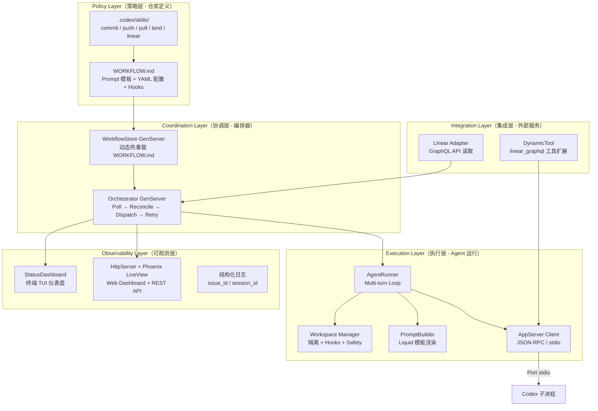
```mermaid
graph TD
    subgraph "Policy Layer（策略层 - 仓库定义）"
        WF["WORKFLOW.md<br/>Prompt 模板 + YAML 配置 + Hooks"]
        SK[".codex/skills/<br/>commit / push / pull / land / linear"]
    end

    subgraph "Coordination Layer（协调层 - 编排器）"
        OR["Orchestrator GenServer<br/>Poll → Reconcile → Dispatch → Retry"]
        WFS["WorkflowStore GenServer<br/>动态热重载 WORKFLOW.md"]
    end

    subgraph "Execution Layer（执行层 - Agent 运行）"
        AR["AgentRunner<br/>Multi-turn Loop"]
        WS["Workspace Manager<br/>隔离 + Hooks + Safety"]
        PB["PromptBuilder<br/>Liquid 模板渲染"]
        AS["AppServer Client<br/>JSON-RPC / stdio"]
    end

    subgraph "Integration Layer（集成层 - 外部服务）"
        LN["Linear Adapter<br/>GraphQL API 读取"]
        DT["DynamicTool<br/>linear_graphql 工具扩展"]
    end

    subgraph "Observability Layer（可观测层）"
        SD["StatusDashboard<br/>终端 TUI 仪表盘"]
        HT["HttpServer + Phoenix LiveView<br/>Web Dashboard + REST API"]
        LG["结构化日志<br/>issue_id / session_id"]
    end

    WF --> WFS
    WFS --> OR
    OR --> AR
    AR --> WS
    AR --> PB
    AR --> AS
    AS --> |"Port stdio"| CX["Codex 子进程"]
    LN --> OR
    DT --> AS
    OR --> SD
    OR --> HT
    SK --> WF
```

## 2. 分层架构

Symphony 采用 **六层分层架构**，便于理解和移植到其他编程语言：

### 2.1 策略层（Policy Layer）

**所有者**：团队/仓库

策略层由仓库中的文件定义，包含：

- **`WORKFLOW.md`**：核心工作流定义文件
  - YAML 前置数据（Front Matter）：运行时配置（tracker、polling、workspace、hooks、agent、codex）
  - Markdown 正文：Agent 的 Prompt 模板
- **`.codex/skills/`**：技能文件目录，定义 Agent 执行特定操作的详细指引（如 commit、push、land 等）

> 设计理念：将 Agent 行为策略与代码一起版本化管理，团队可以通过 PR 来审查和改进 Agent 行为。

### 2.2 配置层（Configuration Layer）

**职责**：类型化配置获取

- 解析 YAML 前置数据为类型化运行时设置
- 处理默认值、环境变量令牌（`$VAR_NAME`）、路径归一化
- 配置验证（dispatch 预检）
- 关键实现：`Config` 模块

配置优先级：
1. 运行时工作流文件路径选择
2. YAML 前置数据值
3. `$VAR_NAME` 环境变量间接引用
4. 内置默认值

### 2.3 协调层（Coordination Layer）

**职责**：调度编排

核心组件：**Orchestrator GenServer**

- 拥有轮询 tick
- 拥有唯一权威的内存运行时状态
- 决定 issue 的调度、重试、停止、释放
- 跟踪 session 指标和重试队列状态

辅助组件：**WorkflowStore GenServer**

- 每 1 秒轮询 `WORKFLOW.md` 变更（mtime + size + hash）
- 变更后自动重载并应用到后续的 dispatch、retry、hook 执行

### 2.4 执行层（Execution Layer）

**职责**：工作空间管理 + Agent 子进程

| 组件 | 职责 |
|------|------|
| `Workspace` | 文件系统生命周期、workspace 准备、安全校验、hook 执行 |
| `AgentRunner` | 创建 workspace → 构建 prompt → 启动 app-server → 多轮 turn 循环 |
| `PromptBuilder` | 使用 Solid（Liquid 兼容）引擎严格渲染 prompt 模板 |
| `AppServer` | 通过 Elixir Port（stdio）与 Codex 子进程进行 JSON-RPC 通信 |

### 2.5 集成层（Integration Layer）

**职责**：外部服务适配

- **Linear Adapter**：通过 GraphQL API 读取 issue 数据
  - `fetch_candidate_issues()` — 获取活跃状态的候选 issue
  - `fetch_issue_states_by_ids()` — 刷新运行中 issue 的状态（reconciliation）
  - `fetch_issues_by_states()` — 启动时获取终态 issue（workspace 清理）
- **DynamicTool**：客户端侧工具扩展
  - 当前支持 `linear_graphql` — 允许 Agent 在会话中直接执行 Linear GraphQL 查询

### 2.6 可观测层（Observability Layer）

**职责**：运维可视化

- **StatusDashboard**：终端 TUI 仪表盘，实时展示 Agent 状态
- **Phoenix LiveView**：可选 Web Dashboard
- **REST API**：`/api/v1/state`、`/api/v1/<issue_identifier>`、`POST /api/v1/refresh`
- **结构化日志**：所有日志包含 `issue_id`、`issue_identifier`、`session_id`

## 3. 核心组件交互流程

### 3.1 完整的 Issue 处理流程

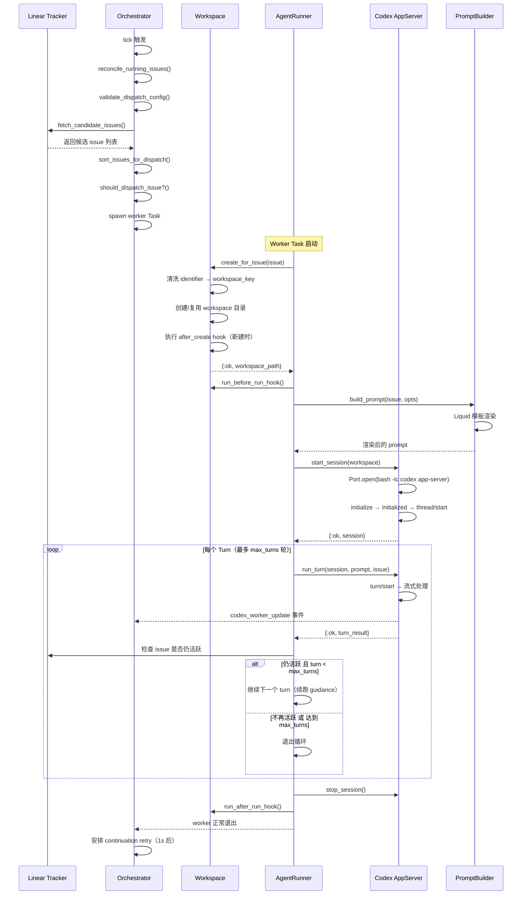
```mermaid
sequenceDiagram
    participant T as Linear Tracker
    participant O as Orchestrator
    participant W as Workspace
    participant A as AgentRunner
    participant C as Codex AppServer
    participant P as PromptBuilder

    O->>O: tick 触发
    O->>O: reconcile_running_issues()
    O->>O: validate_dispatch_config()
    O->>T: fetch_candidate_issues()
    T-->>O: 返回候选 issue 列表
    O->>O: sort_issues_for_dispatch()
    O->>O: should_dispatch_issue?()
    O->>O: spawn worker Task
    
    Note over A: Worker Task 启动
    A->>W: create_for_issue(issue)
    W->>W: 清洗 identifier → workspace_key
    W->>W: 创建/复用 workspace 目录
    W->>W: 执行 after_create hook（新建时）
    W-->>A: {:ok, workspace_path}
    
    A->>W: run_before_run_hook()
    A->>P: build_prompt(issue, opts)
    P->>P: Liquid 模板渲染
    P-->>A: 渲染后的 prompt
    
    A->>C: start_session(workspace)
    C->>C: Port.open(bash -lc codex app-server)
    C->>C: initialize → initialized → thread/start
    C-->>A: {:ok, session}
    
    loop 每个 Turn（最多 max_turns 轮）
        A->>C: run_turn(session, prompt, issue)
        C->>C: turn/start → 流式处理
        C-->>O: codex_worker_update 事件
        C-->>A: {:ok, turn_result}
        A->>T: 检查 issue 是否仍活跃
        alt 仍活跃 且 turn < max_turns
            A->>A: 继续下一个 turn（续跑 guidance）
        else 不再活跃 或 达到 max_turns
            A->>A: 退出循环
        end
    end
    
    A->>C: stop_session()
    A->>W: run_after_run_hook()
    A-->>O: worker 正常退出
    O->>O: 安排 continuation retry（1s 后）
```

### 3.2 Codex 通信协议

Agent 与 Codex App-Server 之间通过 **Elixir Port**（stdio）进行 JSON-RPC 风格的通信：

```
Symphony (Parent)                    Codex App-Server (Child)
      │                                       │
      ├── initialize ────────────────────────► │
      │ ◄──────────────────── initialize/result│
      ├── initialized ──────────────────────► │
      ├── thread/start ─────────────────────► │
      │ ◄──────────────── thread/start/result │
      ├── turn/start ───────────────────────► │
      │ ◄──────────────── turn/start/result   │
      │                                       │
      │    ┌─── 流式事件循环 ───┐             │
      │    │                     │             │
      │ ◄─ │ notification        │ ───────────│
      │ ◄─ │ approval request    │ ───────────│
      ├──► │ approval response   │ ───────────│
      │ ◄─ │ tool call           │ ───────────│
      ├──► │ tool result         │ ───────────│
      │ ◄─ │ turn/completed      │ ───────────│
      │    └─────────────────────┘             │
      │                                       │
      ├── turn/start (续跑) ────────────────► │
      │    ... (重复上述流式循环)              │
      │                                       │
      ├── [Port.close] ────────────────────► │
      │                                       │
```

**关键设计决策**：
- 使用 `Port`（而非 NIF）实现进程隔离，Codex 崩溃不会影响 BEAM VM
- 行定界 JSON 协议，每行一个完整 JSON 消息
- stdout 用于协议消息，stderr 仅用于诊断日志
- 最大行缓冲 1MB（`@port_line_bytes 1_048_576`）

## 4. 进程模型（OTP 监督树）

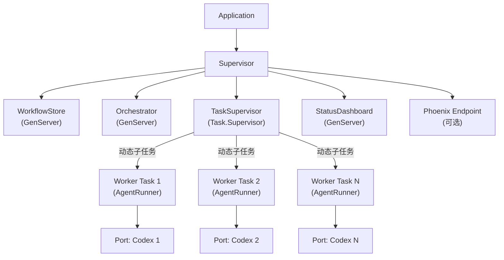
```mermaid
graph TD
    APP["Application"] --> SUP["Supervisor"]
    SUP --> WFS["WorkflowStore<br/>(GenServer)"]
    SUP --> ORC["Orchestrator<br/>(GenServer)"]
    SUP --> TS["TaskSupervisor<br/>(Task.Supervisor)"]
    SUP --> SD["StatusDashboard<br/>(GenServer)"]
    SUP --> EP["Phoenix Endpoint<br/>(可选)"]
    
    TS --> |"动态子任务"| W1["Worker Task 1<br/>(AgentRunner)"]
    TS --> |"动态子任务"| W2["Worker Task 2<br/>(AgentRunner)"]
    TS --> |"动态子任务"| WN["Worker Task N<br/>(AgentRunner)"]
    
    W1 --> P1["Port: Codex 1"]
    W2 --> P2["Port: Codex 2"]
    WN --> PN["Port: Codex N"]
```

**关键设计**：

| 进程 | 类型 | 职责 |
|------|------|------|
| `WorkflowStore` | GenServer（常驻） | 监控 WORKFLOW.md 变更，缓存最后有效配置 |
| `Orchestrator` | GenServer（常驻） | 唯一调度权威，拥有所有运行时状态 |
| `TaskSupervisor` | Task.Supervisor（常驻） | 监督动态 worker 任务的生命周期 |
| `StatusDashboard` | GenServer（常驻） | 聚合状态数据供 TUI/Web 渲染 |
| Worker Task | Task（动态） | 一次性 Agent 运行任务，由 TaskSupervisor 管理 |
| Port | Erlang Port（动态） | 与 Codex 子进程的 stdio 管道 |

## 5. 数据流向

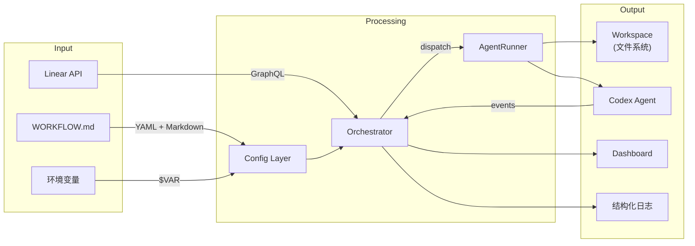
```mermaid
flowchart LR
    subgraph Input
        LINEAR["Linear API"]
        WFMD["WORKFLOW.md"]
        ENV["环境变量"]
    end

    subgraph Processing
        CONFIG["Config Layer"]
        ORCH["Orchestrator"]
        RUNNER["AgentRunner"]
    end

    subgraph Output
        WS["Workspace<br/>(文件系统)"]
        CODEX["Codex Agent"]
        DASH["Dashboard"]
        LOG["结构化日志"]
    end

    LINEAR --> |"GraphQL"| ORCH
    WFMD --> |"YAML + Markdown"| CONFIG
    ENV --> |"$VAR"| CONFIG
    CONFIG --> ORCH
    ORCH --> |"dispatch"| RUNNER
    RUNNER --> WS
    RUNNER --> CODEX
    ORCH --> DASH
    ORCH --> LOG
    CODEX --> |"events"| ORCH
```

## 6. 无状态恢复设计

Symphony 采用**纯内存态**设计，不依赖持久化数据库：

- **重启恢复策略**：
  1. 启动时执行终态 workspace 清理（查询 Linear 终态 issue，删除对应 workspace）
  2. 通过 Tracker 重新拉取活跃 issue
  3. 重新 dispatch 符合条件的工作
  4. 不尝试恢复之前的 retry timer 或 running session

- **设计权衡**：
  - ✅ 简化实现，无需数据库依赖
  - ✅ 利用 Issue Tracker 作为"真相来源"
  - ✅ workspace 文件系统持久化提供跨 session 的工作延续
  - ⚠️ 重启后丢失 retry 队列和 token 统计
  - ⚠️ 重启后需要重新发现并 dispatch 所有工作

> 这种设计体现了 Symphony 作为"调度器/运行器"的定位——它不拥有业务数据，只是一个连接 Issue Tracker 和编码 Agent 的桥梁。

---

# 第四章：Agent Memory 设计

## 概述

Symphony 的 Agent Memory（状态记忆）采用**分层设计**，不依赖持久化数据库，而是通过内存态 + 文件系统 + Issue Tracker 的组合实现完整的状态管理与恢复能力。

整体分为四个层次：

```
┌─────────────────────────────────────────────┐
│  Layer 4: Workpad 外部记忆                   │  ← Linear Issue 评论（跨 session 持久化）
├─────────────────────────────────────────────┤
│  Layer 3: Thread 上下文记忆                   │  ← Codex App-Server Thread（单次 worker run 内）
├─────────────────────────────────────────────┤
│  Layer 2: Workspace 持久化记忆               │  ← 文件系统（跨 run 复用）
├─────────────────────────────────────────────┤
│  Layer 1: Orchestrator Runtime State         │  ← GenServer 内存态（调度核心）
└─────────────────────────────────────────────┘
```

---

## Layer 1: Orchestrator Runtime State（编排器内存态）

### 设计理念

Orchestrator 的运行时状态是**纯内存态**的，作为单一权威数据源（single source of truth），所有调度决策都基于此状态。

### 状态结构

定义在 `SymphonyElixir.Orchestrator.State` 结构体中：

```elixir
defstruct [
  :poll_interval_ms,           # 当前有效轮询间隔
  :max_concurrent_agents,       # 最大并发 Agent 数
  :next_poll_due_at_ms,        # 下次轮询时间（单调时钟）
  :poll_check_in_progress,     # 轮询进行中标志
  running: %{},                # issue_id -> running_entry（正在运行的 Agent 会话）
  completed: MapSet.new(),     # 已完成 issue 集合（仅记账用途）
  claimed: MapSet.new(),       # 已认领的 issue（防止重复调度）
  retry_attempts: %{},         # issue_id -> RetryEntry（重试队列）
  codex_totals: nil,           # 聚合 token 统计
  codex_rate_limits: nil       # 最新速率限制快照
]
```

### Running Entry（运行中条目）

每个正在执行的 Agent 会话在 `running` map 中对应一个完整的元数据条目：

```elixir
%{
  pid: pid,                              # Worker 进程 PID
  ref: ref,                              # 进程监控引用
  identifier: "MT-123",                  # Issue 人类可读标识
  issue: %Issue{},                       # 完整的 Issue 快照
  session_id: "thread-1-turn-1",         # Codex 会话 ID
  last_codex_message: nil,               # 最近一条 Codex 消息摘要
  last_codex_timestamp: nil,             # 最近 Codex 活动时间戳
  last_codex_event: nil,                 # 最近 Codex 事件类型
  codex_app_server_pid: nil,             # Codex 子进程 OS PID
  codex_input_tokens: 0,                 # 累计输入 token
  codex_output_tokens: 0,                # 累计输出 token
  codex_total_tokens: 0,                 # 累计总 token
  codex_last_reported_input_tokens: 0,   # 最近上报输入 token（用于增量计算）
  codex_last_reported_output_tokens: 0,  # 最近上报输出 token
  codex_last_reported_total_tokens: 0,   # 最近上报总 token
  turn_count: 0,                         # 当前 worker 内的 turn 计数
  retry_attempt: 0,                      # 重试次数
  started_at: DateTime.utc_now()         # 启动时间
}
```

### Retry Entry（重试条目）

```elixir
%{
  attempt: 1,                    # 重试次数（1-based）
  timer_ref: timer_ref,          # Erlang 定时器引用
  due_at_ms: monotonic_ms,       # 到期时间（单调时钟）
  identifier: "MT-123",          # Issue 标识（日志/状态面板用）
  error: "agent exited: ..."     # 错误原因
}
```

### 关键设计决策

| 决策 | 理由 |
|------|------|
| **纯内存态，无持久化 DB** | 简化架构，重启后通过 Tracker 驱动 + 文件系统重建状态 |
| **`claimed` Set 防重复** | 确保同一 issue 不会被并发 dispatch 两次 |
| **`completed` Set 仅记账** | 不作为 dispatch 门控条件，因为 issue 可能需要续跑 |
| **增量 Token 计算** | 通过 `last_reported_*` 字段避免重复计数 |
| **单调时钟用于定时** | 避免系统时间回拨导致调度异常 |

---

## Layer 2: Workspace 持久化记忆（文件系统）

### 设计理念

每个 issue 对应一个**独立的 workspace 目录**，在 runs 之间被复用，提供跨会话的文件系统级持久化。

### 目录结构

```
<workspace_root>/
  ├── MT-123/           # issue "MT-123" 的 workspace
  │   ├── .git/         # Git 仓库（由 after_create hook 克隆）
  │   ├── src/          # 源码
  │   └── ...
  ├── MT-124/           # 另一个 issue 的 workspace
  └── ...
```

### 生命周期

```
Issue 进入活跃状态
    │
    ▼
create_for_issue()
    ├── 目录不存在 → 创建 + 运行 after_create hook
    └── 目录已存在 → 复用（清理 tmp/.elixir_ls）
    │
    ▼
Agent 运行（可能多次 run）
    │
    ▼
Issue 进入终态（Done/Closed/Cancelled）
    │
    ▼
remove_issue_workspaces() → 运行 before_remove hook → 删除目录
```

### 关键特性

- **跨 run 复用**：Agent 续跑时可以利用之前的代码变更、分支状态
- **hook 驱动初始化**：workspace 的内容（如 git clone）由 `after_create` hook 控制
- **安全隔离**：路径限制在 workspace root 内，名称仅允许 `[A-Za-z0-9._-]`
- **符号链接检测**：递归检查路径组件防止符号链接逃逸

---

## Layer 3: Thread 上下文记忆（Codex 会话内）

### 设计理念

通过 Codex App-Server 的 **Thread** 概念实现单次 worker run 内的多 turn 上下文保持。

### 工作方式

```
Worker Run 开始
    │
    ▼
AppServer.start_session()
    │  ← thread/start → 获得 thread_id
    ▼
Turn 1: 发送完整渲染后的 prompt
    │  ← turn/start(threadId, full_prompt)
    ▼
Turn 2: 仅发送续跑指导（continuation guidance）
    │  ← turn/start(threadId, continuation_guidance)
    ▼
Turn N: 继续续跑...
    │
    ▼
AppServer.stop_session()
```

### 首 Turn vs 续跑 Turn

**首 Turn Prompt**（完整任务上下文）：
- 由 WORKFLOW.md 模板渲染而成
- 包含 issue 的完整信息（标题、描述、标签、blocker 等）
- 包含工作流指令（状态流转、验收标准、工作笔记模板等）

**续跑 Turn Prompt**（精简指导）：
```
Continuation guidance:

- The previous Codex turn completed normally, but the Linear issue is still in an active state.
- This is continuation turn #N of M for the current agent run.
- Resume from the current workspace and workpad state instead of restarting from scratch.
- The original task instructions and prior turn context are already present in this thread,
  so do not restate them before acting.
- Focus on the remaining ticket work and do not end the turn while the issue stays active
  unless you are truly blocked.
```

### 关键特性

- **同一 thread_id 复用**：同一 worker run 内的所有 turn 共享上下文
- **避免重复上下文**：续跑 turn 不重发原始 prompt，减少 token 消耗
- **最大 turn 限制**：`agent.max_turns`（默认 20），防止无限循环

---

## Layer 4: Workpad 外部记忆（Issue Tracker 评论）

### 设计理念

利用 Linear Issue 的**单条持久化评论**作为 Agent 的外部工作台，实现跨 session、跨 run 的结构化记忆。

### Workpad 结构

在 WORKFLOW.md 的 prompt 中定义了标准化的工作笔记模板：

---

# 第五章：Agent Loop 循环机制

Symphony 采用**三层嵌套循环**设计，形成完整的自主执行闭环：Orchestrator Poll Loop → Worker Turn Loop → Continuation/Retry Loop。

---

## 1. 整体循环架构

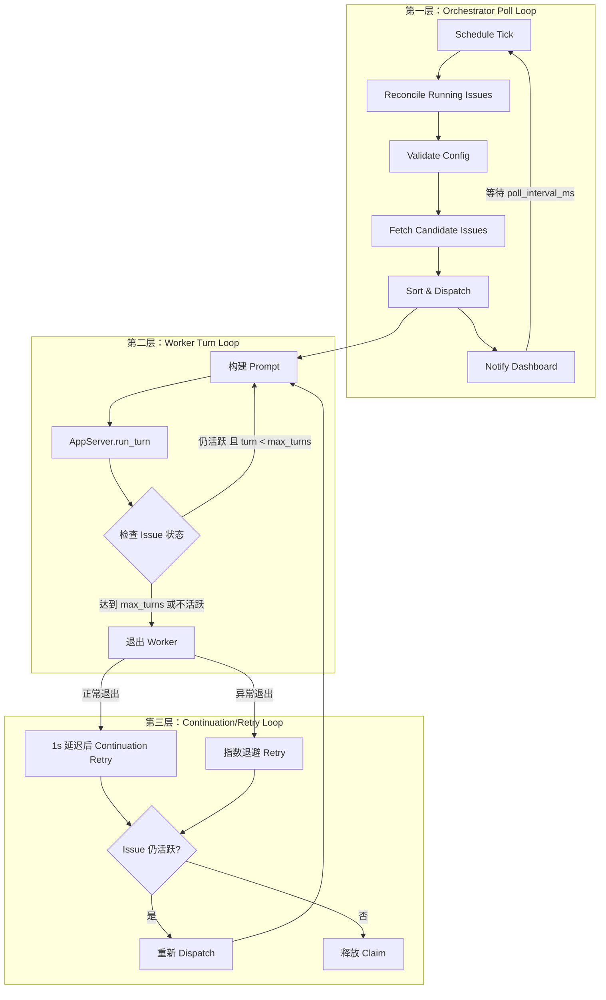
```mermaid
graph TD
    subgraph "第一层：Orchestrator Poll Loop"
        A[Schedule Tick] --> B[Reconcile Running Issues]
        B --> C[Validate Config]
        C --> D[Fetch Candidate Issues]
        D --> E[Sort & Dispatch]
        E --> F[Notify Dashboard]
        F -->|等待 poll_interval_ms| A
    end

    subgraph "第二层：Worker Turn Loop"
        G[构建 Prompt] --> H[AppServer.run_turn]
        H --> I{检查 Issue 状态}
        I -->|仍活跃 且 turn < max_turns| G
        I -->|达到 max_turns 或不活跃| J[退出 Worker]
    end

    subgraph "第三层：Continuation/Retry Loop"
        J -->|正常退出| K[1s 延迟后 Continuation Retry]
        J -->|异常退出| L[指数退避 Retry]
        K --> M{Issue 仍活跃?}
        L --> M
        M -->|是| N[重新 Dispatch]
        M -->|否| O[释放 Claim]
    end

    E --> G
    N --> G
```

---

## 2. 第一层：Orchestrator Poll Loop

### 2.1 触发机制

Poll Loop 由 Orchestrator GenServer 的 `handle_info(:tick, state)` 驱动，每隔 `polling.interval_ms`（默认 30 秒）触发一次。

**源码位置**：`elixir/lib/symphony_elixir/orchestrator.ex`

```elixir
# 初始化时立即调度第一个 tick
def init(_opts) do
  # ...
  :ok = schedule_tick(0)
  {:ok, state}
end

# tick 到达时刷新配置、标记轮询进行中，然后触发实际的轮询周期
def handle_info(:tick, state) do
  state = refresh_runtime_config(state)
  state = %{state | poll_check_in_progress: true, next_poll_due_at_ms: nil}
  notify_dashboard()
  :ok = schedule_poll_cycle_start()
  {:noreply, state}
end

# 实际的轮询周期：协调 + 调度 + 安排下一个 tick
def handle_info(:run_poll_cycle, state) do
  state = refresh_runtime_config(state)
  state = maybe_dispatch(state)
  # ...安排下一个 tick...
  {:noreply, state}
end
```

### 2.2 Tick 执行顺序

每个 tick 严格按以下顺序执行：

| 步骤 | 操作 | 说明 |
|------|------|------|
| 1 | **Reconcile** | 检测停滞会话 + 刷新 Tracker 状态 |
| 2 | **Validate** | 校验 WORKFLOW.md 配置有效性 |
| 3 | **Fetch** | 从 Linear API 拉取候选 Issue |
| 4 | **Sort** | 按优先级排序候选 Issue |
| 5 | **Dispatch** | 在并发槽位可用时逐个分发 |
| 6 | **Notify** | 通知 StatusDashboard 更新 |

### 2.3 关键设计决策

- **Reconciliation 先于 Dispatch**：每个 tick 先协调当前运行中的任务，再分发新任务，确保状态一致性
- **Config 验证失败不阻塞协调**：验证失败只跳过本轮 dispatch，reconciliation 仍然执行
- **动态配置刷新**：每个 tick 开始时调用 `refresh_runtime_config(state)`，自动应用 WORKFLOW.md 的最新配置

---

## 3. 第二层：Worker Turn Loop

### 3.1 执行流程

Worker Turn Loop 在 `AgentRunner` 模块中实现，是单个 Issue 的多轮对话循环。

**源码位置**：`elixir/lib/symphony_elixir/agent_runner.ex`

```elixir
defp do_run_codex_turns(app_session, workspace, issue, codex_update_recipient, opts, 
                         issue_state_fetcher, turn_number, max_turns) do
  # 1. 构建本轮 prompt
  prompt = build_turn_prompt(issue, opts, turn_number, max_turns)

  # 2. 执行一个 turn
  with {:ok, turn_session} <- AppServer.run_turn(app_session, prompt, issue, ...) do
    
    # 3. 检查 issue 是否仍在活跃状态
    case continue_with_issue?(issue, issue_state_fetcher) do
      {:continue, refreshed_issue} when turn_number < max_turns ->
        # 递归继续下一个 turn
        do_run_codex_turns(app_session, workspace, refreshed_issue, ..., 
                           turn_number + 1, max_turns)

      {:continue, _refreshed_issue} ->
        # 达到 max_turns，返回控制权给 orchestrator
        :ok

      {:done, _refreshed_issue} ->
        # Issue 不再活跃，正常退出
        :ok
    end
  end
end
```

### 3.2 首轮 vs 续跑 Prompt

Turn Loop 中首轮和续跑轮使用不同的 prompt 策略：

- **首轮（turn_number == 1）**：发送完整的渲染后 prompt（包含 Issue 详情、工作指导等）
- **续跑轮（turn_number > 1）**：仅发送简洁的 continuation guidance

```elixir
# 首轮：完整 prompt
defp build_turn_prompt(issue, opts, 1, _max_turns), do: PromptBuilder.build_prompt(issue, opts)

# 续跑轮：continuation guidance
defp build_turn_prompt(_issue, _opts, turn_number, max_turns) do
  """
  Continuation guidance:
  - The previous Codex turn completed normally, but the Linear issue is still in an active state.
  - This is continuation turn ##{turn_number} of #{max_turns} for the current agent run.
  - Resume from the current workspace and workpad state instead of restarting from scratch.
  - Focus on the remaining ticket work...
  """
end
```

### 3.3 Turn 结束条件

每个 turn 完成后，Worker 会**重新查询 Issue 状态**来决定后续行为：

| 条件 | 行为 |
|------|------|
| Issue 仍活跃 且 `turn_number < max_turns` | 递归进入下一个 turn |
| Issue 仍活跃 但 `turn_number >= max_turns` | 正常退出，让 Orchestrator 安排 continuation |
| Issue 不再活跃 | 正常退出 |
| Issue 状态查询失败 | 返回错误 |

### 3.4 同一 Thread 内的多轮对话

关键设计：**同一个 Worker Turn Loop 内的所有 turn 共享同一个 Codex thread**。

- `thread_id` 在 `start_session` 时获取，在所有 turn 中复用
- 每个 turn 获得新的 `turn_id`
- `session_id = "<thread_id>-<turn_id>"`
- AppServer 子进程在整个 Worker 运行期间保持存活

---

## 4. 第三层：Continuation/Retry Loop

### 4.1 正常退出 → Continuation Retry

Worker 正常退出（`:normal`）后，Orchestrator 不认为任务已完成，而是安排一个 **1 秒延迟的 continuation retry**：

```elixir
def handle_info({:DOWN, ref, :process, _pid, reason}, state) do
  case reason do
    :normal ->
      # 正常退出：安排 continuation check
      state
      |> complete_issue(issue_id)      # 记账（加入 completed set）
      |> schedule_issue_retry(issue_id, 1, %{
        identifier: running_entry.identifier,
        delay_type: :continuation       # 标记为 continuation 类型
      })

    _ ->
      # 异常退出：安排指数退避重试
      schedule_issue_retry(state, issue_id, next_attempt, %{
        identifier: running_entry.identifier,
        error: "agent exited: #{inspect(reason)}"
      })
  end
end
```

Continuation retry 触发时会：
1. 重新查询 Issue 是否仍在活跃状态
2. 如果活跃 → 重新 dispatch 一个新的 Worker session
3. 如果不活跃 → 释放 claim

### 4.2 异常退出 → 指数退避 Retry

异常退出走指数退避策略：

```
delay = min(10000 * 2^(attempt - 1), max_retry_backoff_ms)
```

| 重试次数 | 延迟时间 |
|----------|----------|
| 1 | 10 秒 |
| 2 | 20 秒 |
| 3 | 40 秒 |
| 4 | 80 秒 |
| 5 | 160 秒 |
| 6+ | 300 秒（上限，默认 5 分钟） |

### 4.3 Retry 处理流程

当 retry timer 触发时（`handle_info({:retry_issue, issue_id}, state)`）：

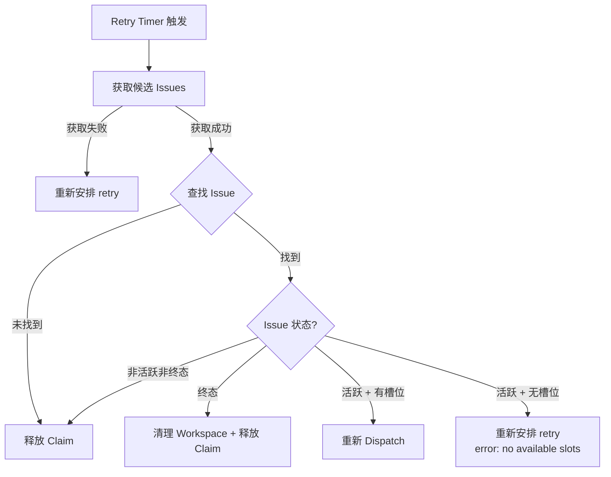
```mermaid
graph TD
    A[Retry Timer 触发] --> B[获取候选 Issues]
    B -->|获取失败| C[重新安排 retry]
    B -->|获取成功| D{查找 Issue}
    D -->|未找到| E[释放 Claim]
    D -->|找到| F{Issue 状态?}
    F -->|终态| G[清理 Workspace + 释放 Claim]
    F -->|活跃 + 有槽位| H[重新 Dispatch]
    F -->|活跃 + 无槽位| I[重新安排 retry<br/>error: no available slots]
    F -->|非活跃非终态| E
```

### 4.4 停滞检测（Stall Detection）

作为 Reconciliation 的一部分，停滞检测也形成了一个隐式的循环：

- 每个 tick 检查所有运行中的 Issue
- 计算 `elapsed_ms = now - last_codex_timestamp`（或 `started_at`）
- 如果 `elapsed_ms > codex.stall_timeout_ms`（默认 5 分钟）→ 终止 Worker + 安排 retry
- `stall_timeout_ms <= 0` 时禁用停滞检测

---

## 5. 三层循环的协作关系

```
Orchestrator Poll Loop（30s 周期）
├── Reconcile：检测停滞、刷新状态
├── Dispatch：启动新 Worker
│   └── Worker Turn Loop（单个 Issue）
│       ├── Turn 1：完整 prompt → Codex 执行 → 检查状态
│       ├── Turn 2：continuation guidance → Codex 执行 → 检查状态
│       ├── ...
│       └── Turn N：达到 max_turns 或 Issue 不活跃 → 退出
└── Worker 退出后
    └── Continuation/Retry Loop
        ├── 正常退出 → 1s 后 continuation retry
        │   └── Issue 仍活跃 → 新的 Worker Turn Loop（新 session）
        └── 异常退出 → 指数退避 retry
            └── Issue 仍活跃 → 新的 Worker Turn Loop（新 session）
```

### 关键特性总结

| 特性 | 说明 |
|------|------|
| **自动持续跟进** | 正常退出后自动安排 continuation，无需人工干预 |
| **跨 session 连续性** | Workspace 在 session 间复用，Agent 可继续之前的工作 |
| **弹性恢复** | 异常退出自动重试，指数退避避免雪崩 |
| **外部状态驱动** | 每次循环都重新查询 Tracker 状态，确保行为与外部一致 |
| **有界执行** | `max_turns` 限制单次 session 的 turn 数，`max_retry_backoff_ms` 限制重试延迟上限 |
| **单一权威** | 所有状态变更都经过 Orchestrator GenServer 序列化，避免并发冲突 |

---

# 第六章：Agent Rules 规则体系

本文档详细介绍 Symphony 中 Agent 运行所遵循的各类规则，包括调度（Dispatch）、协调（Reconciliation）、工作空间安全（Workspace Safety）、审批/沙箱（Approval/Sandbox）以及重试与退避等方面。

## 1. Dispatch 规则（调度准入）

### 1.1 候选 Issue 准入条件

一个 Issue 要被调度给 Agent 执行，必须**同时满足**以下所有条件：

| # | 条件 | 说明 |
|---|------|------|
| 1 | 具备必要字段 | `id`、`identifier`、`title`、`state` 均为非空字符串 |
| 2 | 状态在活跃集合中 | `state ∈ active_states`（默认 `Todo`, `In Progress`） |
| 3 | 状态不在终态集合中 | `state ∉ terminal_states`（默认 `Closed`, `Cancelled`, `Canceled`, `Duplicate`, `Done`） |
| 4 | 未在运行中 | `issue.id ∉ running` map |
| 5 | 未被认领 | `issue.id ∉ claimed` set |
| 6 | 全局并发槽位可用 | `available_slots = max(max_concurrent_agents - running_count, 0) > 0` |
| 7 | 每状态并发槽位可用 | `running_count_for_state < max_concurrent_agents_by_state[state]` |
| 8 | Blocker 规则通过 | 若 `state == "Todo"`，则所有 blocker 必须处于终态 |

> **状态比较规则**：所有状态名称在比较前统一执行 `trim + lowercase` 标准化。

### 1.2 调度优先级排序

当多个 Issue 同时满足准入条件时，按以下规则排序（稳定排序）：

```
优先级1: priority 升序（1-4 有效，null/未知排最后，视为 5）
优先级2: created_at 最早优先（null 排最后）
优先级3: identifier 字典序兜底
```

对应实现位于 `orchestrator.ex` 的 `sort_issues_for_dispatch/1`：

```elixir
defp sort_issues_for_dispatch(issues) do
  Enum.sort_by(issues, fn %Issue{} = issue ->
    {priority_rank(issue.priority),
     issue_created_at_sort_key(issue),
     issue.identifier || issue.id || ""}
  end)
end
```

### 1.3 Dispatch 前再验证

在真正 dispatch 之前，Orchestrator 会对候选 Issue 执行**二次验证**（`revalidate_issue_for_dispatch`）：

1. 通过 Tracker API 重新获取 Issue 最新状态
2. 如果 Issue 仍然是候选状态 → 执行 dispatch
3. 如果 Issue 已不可见 → 跳过 dispatch
4. 如果 Issue 状态已变更为不合格 → 跳过 dispatch
5. 如果 API 调用失败 → 跳过 dispatch 并记录警告

这确保了从 fetch 到 dispatch 之间的时间窗口内状态变更不会导致错误调度。

### 1.4 并发控制规则

**全局限制**：

```
available_slots = max(max_concurrent_agents - map_size(running), 0)
```

**每状态限制**：

```
limit = max_concurrent_agents_by_state[normalized_state] 或 全局限制（fallback）
used  = running 中相同 state 的 issue 计数
可用  = limit > used
```

状态名在查询限制时同样执行 `trim + lowercase` 标准化。

## 2. Reconciliation 规则（运行时协调）

Reconciliation 在每次 Poll Tick 中**优先于 Dispatch** 执行，分为两部分：

### 2.1 Part A: 停滞检测（Stall Detection）

针对每个正在运行的 Issue，计算自上次活动以来的经过时间：

```
elapsed_ms = now - (last_codex_timestamp || started_at)
```

**规则**：

| 条件 | 动作 |
|------|------|
| `stall_timeout_ms <= 0` | 跳过停滞检测（功能禁用） |
| `elapsed_ms > stall_timeout_ms`（默认 5 分钟） | 终止 Worker + 安排指数退避重试 |
| `elapsed_ms <= stall_timeout_ms` | 不做处理，继续运行 |

### 2.2 Part B: Tracker 状态刷新

从 Issue Tracker 批量获取所有 running Issue 的最新状态，逐一处理：

| Tracker 返回的状态 | 动作 |
|-------------------|------|
| **终态**（Done, Closed 等） | 终止 Worker + **清理 Workspace** |
| **仍然活跃**（Todo, In Progress 等） | 更新内存中的 Issue 快照 |
| **非活跃非终态**（其他中间状态） | 终止 Worker + **不清理 Workspace** |
| **Worker 不再可路由**（`assigned_to_worker == false`） | 终止 Worker + 不清理 Workspace |
| **Tracker API 调用失败** | 保持当前 Worker 不变，下次 Tick 重试 |

> **设计意图**：终态清理 Workspace 是因为该 Issue 已完结；非活跃但非终态不清理，是因为 Issue 可能被重新激活。

### 2.3 启动时终态清理

服务启动时执行一次性清理：

```
1. 查询 Tracker 中所有处于 terminal_states 的 Issue
2. 对每个 Issue 的 identifier，删除对应的 Workspace 目录
3. 如果查询失败 → 记录警告，继续启动（不阻塞）
```

## 3. Workspace 安全规则

这是**最重要的可移植性约束**，定义了三个安全不变量：

### 3.1 不变量 1: Agent 只在 per-issue Workspace 中运行

```
前置条件：cwd == workspace_path
```

在启动 Codex 子进程前，必须验证工作目录就是该 Issue 的 Workspace 路径。

### 3.2 不变量 2: Workspace 路径必须在 Workspace Root 内

```elixir
# 实现逻辑（app_server.ex + workspace.ex）
expanded_workspace = Path.expand(workspace)
workspace_root = Path.expand(Config.workspace_root())

# 前缀校验
String.starts_with?(expanded_workspace <> "/", workspace_root <> "/")

# 符号链接检测（逐级检查路径组件）
ensure_no_symlink_components(expanded_workspace, workspace_root)
```

**拒绝场景**：
- Workspace 路径等于 Root 路径本身
- Workspace 路径不以 Root 路径为前缀
- 路径中任一组件是符号链接（防止符号链接逃逸）

### 3.3 不变量 3: Workspace 目录名必须经过清洗

```elixir
# 只允许 [A-Za-z0-9._-]，其余字符替换为 _
defp safe_identifier(identifier) do
  String.replace(identifier || "issue", ~r/[^a-zA-Z0-9._-]/, "_")
end
```

例如：`ABC-123` → `ABC-123`，`foo/bar:baz` → `foo_bar_baz`

## 4. Approval / Sandbox 规则

### 4.1 审批策略

审批策略通过 `codex.approval_policy` 配置，在 Codex App-Server 启动时传递。

**自动批准模式**（`approval_policy: "never"`，即从不请求人工审批）：

| 请求类型 | 响应动作 |
|---------|---------|
| `item/commandExecution/requestApproval` | 自动批准（`acceptForSession`） |
| `item/fileChange/requestApproval` | 自动批准（`acceptForSession`） |
| `execCommandApproval` | 自动批准（`approved_for_session`） |
| `applyPatchApproval` | 自动批准（`approved_for_session`） |

**非自动批准模式**：返回 `approval_required` 错误，终止当前 run。

### 4.2 用户输入处理

| 场景 | 处理方式 |
|------|---------|
| `item/tool/requestUserInput` 且包含可识别的审批选项 | 自动选择 "Approve this Session" / "Approve Once" |
| `item/tool/requestUserInput` 但无法自动回答 | 回复 "This is a non-interactive session" 固定文本 |
| `turn/input_required` 等输入请求 | **硬失败** — 立即终止当前 run |

### 4.3 Dynamic Tool Call 处理

| 场景 | 处理方式 |
|------|---------|
| 已注册的 Dynamic Tool（如 `linear_graphql`） | 执行并返回结果 |
| 未注册的 Tool | 返回失败响应（`success: false`），**不阻塞**会话 |

### 4.4 沙箱策略

通过 `codex.thread_sandbox` 和 `codex.turn_sandbox_policy` 配置：

- **Thread 级别**：`thread_sandbox`（如 `workspace-write`），在 `thread/start` 时设置
- **Turn 级别**：`turn_sandbox_policy`（如 `{type: "workspaceWrite"}`），在 `turn/start` 时设置

## 5. 重试与退避规则

### 5.1 正常退出 → 续跑重试

```
Worker 正常退出（:normal）
  → 记录到 completed 集合（仅记账）
  → 安排 continuation retry：delay = 1000ms, attempt = 1
  → 1秒后重新检查 Issue 是否仍然活跃
    → 活跃 + 有槽位 → 重新 dispatch
    → 不活跃 → 释放 claim
    → 无槽位 → 再次重试（attempt + 1，使用指数退避）
```

### 5.2 异常退出 → 指数退避重试

```
Worker 异常退出（非 :normal）
  → 安排 failure retry：attempt = 上次 attempt + 1
  → 退避公式：delay = min(10000 * 2^(attempt-1), max_retry_backoff_ms)
  → 指数上限：attempt-1 最大为 10（即 2^10 = 1024 倍）
  → 最大延迟：max_retry_backoff_ms（默认 300000ms = 5 分钟）
```

**退避延迟示例**：

| Attempt | 公式 | 延迟 |
|---------|------|------|
| 1 | 10000 × 2^0 | 10s |
| 2 | 10000 × 2^1 | 20s |
| 3 | 10000 × 2^2 | 40s |
| 4 | 10000 × 2^3 | 80s |
| 5 | 10000 × 2^4 | 160s |
| 6 | min(10000 × 2^5, 300000) | 300s (capped) |

### 5.3 重试时的 Issue 状态检查

重试定时器触发后，执行以下决策流程：

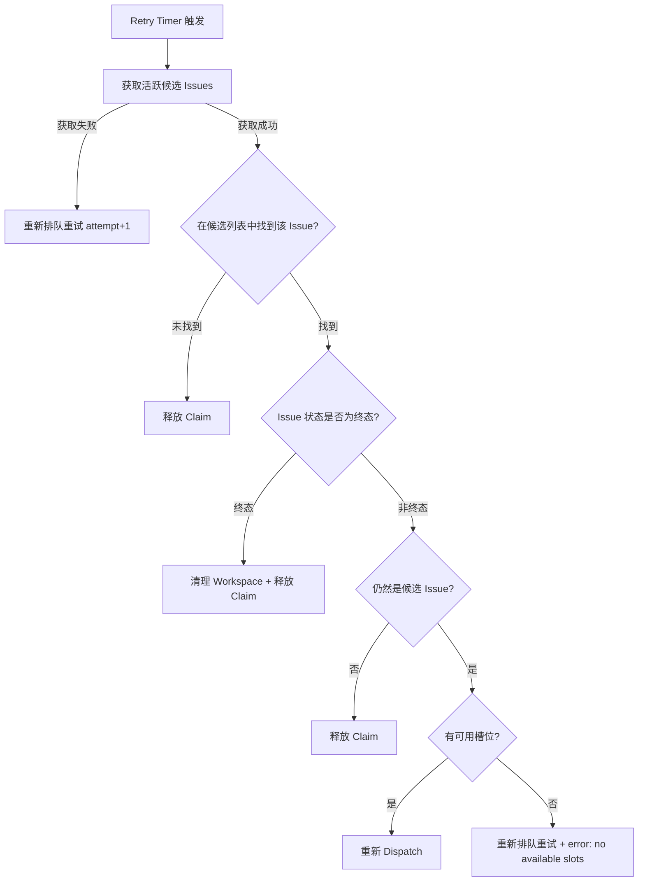
```mermaid
graph TD
    A[Retry Timer 触发] --> B[获取活跃候选 Issues]
    B -->|获取失败| C[重新排队重试 attempt+1]
    B -->|获取成功| D{在候选列表中找到该 Issue?}
    D -->|未找到| E[释放 Claim]
    D -->|找到| F{Issue 状态是否为终态?}
    F -->|终态| G[清理 Workspace + 释放 Claim]
    F -->|非终态| H{仍然是候选 Issue?}
    H -->|否| I[释放 Claim]
    H -->|是| J{有可用槽位?}
    J -->|是| K[重新 Dispatch]
    J -->|否| L[重新排队重试 + error: no available slots]
```

### 5.4 重试队列管理规则

- 同一 Issue 在队列中只有**一个**重试条目
- 新重试会**取消**该 Issue 之前的重试定时器
- 重试条目记录：`attempt`、`due_at_ms`、`timer_ref`、`identifier`、`error`
- `claimed` set 在重试期间保持 Issue 的认领状态，防止重复调度

## 6. 配置验证规则（Dispatch 前置检查）

每次 Tick 在 Dispatch 前会执行配置验证，任一检查失败则**跳过本次 Dispatch**（但 Reconciliation 仍然执行）：

| 检查项 | 错误码 |
|--------|--------|
| WORKFLOW.md 可加载且可解析 | `missing_workflow_file` / `workflow_parse_error` |
| `tracker.kind` 存在且受支持 | `missing_tracker_kind` / `unsupported_tracker_kind` |
| `tracker.api_key` 存在（经 `$VAR` 解析后） | `missing_linear_api_token` |
| `tracker.project_slug` 存在 | `missing_linear_project_slug` |
| `codex.command` 存在且非空 | `missing_codex_command` |
| `codex.approval_policy` 值合法 | `invalid_codex_approval_policy` |
| `codex.thread_sandbox` 值合法 | `invalid_codex_thread_sandbox` |
| `codex.turn_sandbox_policy` 值合法 | `invalid_codex_turn_sandbox_policy` |

## 7. Hook 执行规则

Workspace Hooks 在不同生命周期阶段执行，有不同的失败语义：

| Hook | 执行时机 | 失败影响 | 超时处理 |
|------|---------|---------|---------|
| `after_create` | Workspace **首次**创建后 | **致命** — 中止 Workspace 创建 | 同致命 |
| `before_run` | 每次 Agent 运行前 | **致命** — 中止当前 run attempt | 同致命 |
| `after_run` | 每次 Agent 运行后 | **忽略** — 仅记录日志 | 同忽略 |
| `before_remove` | Workspace 删除前 | **忽略** — 仅记录日志，清理继续 | 同忽略 |

**通用规则**：
- 执行环境：`sh -lc <script>`，工作目录为 Workspace 路径
- 超时：`hooks.timeout_ms`（默认 60000ms）
- 超时后强制终止 Hook 进程（`brutal_kill`）

## 8. 规则总结流程图

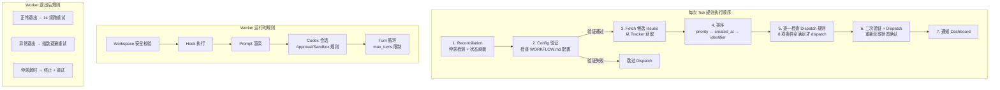
```mermaid
graph TB
    subgraph "每次 Tick 规则执行顺序"
        A[1. Reconciliation<br/>停滞检测 + 状态刷新] --> B[2. Config 验证<br/>检查 WORKFLOW.md 配置]
        B -->|验证通过| C[3. Fetch 候选 Issues<br/>从 Tracker 获取]
        B -->|验证失败| X[跳过 Dispatch]
        C --> D[4. 排序<br/>priority → created_at → identifier]
        D --> E[5. 逐一检查 Dispatch 规则<br/>8 项条件全满足才 dispatch]
        E --> F[6. 二次验证 + Dispatch<br/>重新获取状态确认]
        F --> G[7. 通知 Dashboard]
    end

    subgraph "Worker 运行时规则"
        H[Workspace 安全校验] --> I[Hook 执行]
        I --> J[Prompt 渲染]
        J --> K[Codex 会话<br/>Approval/Sandbox 规则]
        K --> L[Turn 循环<br/>max_turns 限制]
    end

    subgraph "Worker 退出后规则"
        M[正常退出 → 1s 续跑重试]
        N[异常退出 → 指数退避重试]
        O[停滞超时 → 终止 + 重试]
    end
```

---

# 第七章：Prompt 构建与 WORKFLOW.md 工作流合约

## 1. 概述

Symphony 的核心设计哲学之一是 **"WORKFLOW.md 即代码"**——将工作流策略（Agent Prompt、运行时配置、Hooks、Tracker 选择）全部存放在仓库中的一个 Markdown 文件中，与业务代码一起版本化管理。这使得团队可以像审查代码一样审查 Agent 的行为策略。

相关源码文件：
- `elixir/lib/symphony_elixir/workflow.ex` — Workflow 文件加载与解析
- `elixir/lib/symphony_elixir/workflow_store.ex` — 动态热重载缓存
- `elixir/lib/symphony_elixir/prompt_builder.ex` — Prompt 模板渲染
- `elixir/lib/symphony_elixir/config.ex` — 配置层（类型化 getter）

---

## 2. WORKFLOW.md 文件格式

### 2.1 整体结构

`WORKFLOW.md` 是一个带有 **YAML 前置数据（Front Matter）** 的 Markdown 文件，由两部分组成：

```
---
<YAML 前置数据：运行时配置>
---
<Markdown 正文：Prompt 模板>
```

### 2.2 解析规则

1. 如果文件以 `---` 开头，解析到下一个 `---` 之间的内容为 YAML 前置数据
2. 剩余行成为 Prompt 正文
3. 如果没有前置数据，整个文件视为 Prompt 正文，使用空配置 map
4. YAML 前置数据必须解码为 map/object；非 map 的 YAML 会报错
5. Prompt 正文在使用前会被 trim

### 2.3 返回的 Workflow 对象

```
{
  config: <前置数据根对象>,
  prompt_template: <trim 后的 Markdown 正文>
}
```

---

## 3. YAML 前置数据配置 Schema

### 3.1 顶层键

| 键 | 用途 |
|---|---|
| `tracker` | Issue Tracker 配置（类型、端点、认证、项目、状态） |
| `polling` | 轮询间隔配置 |
| `workspace` | 工作空间根目录 |
| `hooks` | 工作空间生命周期钩子脚本 |
| `agent` | Agent 并发、重试、turn 数限制 |
| `codex` | Codex App-Server 启动命令、审批策略、沙箱、超时 |
| `server`（扩展） | 可选 HTTP 服务端口配置 |

未知键会被忽略（前向兼容）。

### 3.2 `tracker` 配置

```yaml
tracker:
  kind: linear                    # 必需，当前支持 "linear"
  endpoint: https://api.linear.app/graphql  # 默认值
  api_key: $LINEAR_API_KEY        # 支持 $VAR 环境变量间接引用
  project_slug: "my-project"      # Linear 项目 slugId，必需
  active_states:                  # 默认 ["Todo", "In Progress"]
    - Todo
    - In Progress
  terminal_states:                # 默认 ["Closed", "Cancelled", "Canceled", "Duplicate", "Done"]
    - Done
    - Closed
```

- `api_key` 支持字面量或 `$VAR_NAME` 形式的环境变量引用
- `$VAR_NAME` 解析为空字符串时，视为缺失
- `active_states` / `terminal_states` 支持列表或逗号分隔字符串

### 3.3 `polling` 配置

```yaml
polling:
  interval_ms: 30000  # 默认 30 秒
```

运行时动态生效，无需重启。

### 3.4 `workspace` 配置

```yaml
workspace:
  root: ~/code/symphony-workspaces  # 默认 <系统临时目录>/symphony_workspaces
```

支持 `~` 展开和 `$VAR` 环境变量。

### 3.5 `hooks` 配置

```yaml
hooks:
  after_create: |          # 仅在新建 workspace 时运行
    git clone --depth 1 https://github.com/myorg/repo .
  before_run: |            # 每次 Agent 尝试前运行
    git pull origin main
  after_run: |             # 每次 Agent 尝试后运行（失败也运行）
    echo "run completed"
  before_remove: |         # 删除 workspace 前运行
    echo "cleaning up"
  timeout_ms: 60000        # 所有 hook 的超时，默认 60 秒
```

**失败语义：**

| Hook | 失败影响 |
|------|---------|
| `after_create` | **致命** — 中止 workspace 创建 |
| `before_run` | **致命** — 中止当前 run 尝试 |
| `after_run` | 记录日志但忽略 |
| `before_remove` | 记录日志但忽略，清理继续 |

### 3.6 `agent` 配置

```yaml
agent:
  max_concurrent_agents: 10       # 全局最大并发 Agent 数，默认 10
  max_turns: 20                   # 单次 worker 最大 turn 数，默认 20
  max_retry_backoff_ms: 300000    # 最大重试退避（5分钟），默认 300000
  max_concurrent_agents_by_state: # 按状态限制并发数
    todo: 3
    in progress: 5
```

### 3.7 `codex` 配置

```yaml
codex:
  command: codex app-server       # 启动命令，默认 "codex app-server"
  approval_policy: never          # Codex AskForApproval 值
  thread_sandbox: workspace-write # Codex SandboxMode 值
  turn_sandbox_policy:            # Codex SandboxPolicy 对象
    type: workspaceWrite
  turn_timeout_ms: 3600000        # turn 超时（1小时），默认 3600000
  read_timeout_ms: 5000           # 请求/响应超时，默认 5000
  stall_timeout_ms: 300000        # 停滞检测超时（5分钟），默认 300000
```

---

## 4. Prompt 模板系统

### 4.1 模板引擎

Symphony 使用 **Solid**（Liquid 兼容的模板引擎）来渲染 Prompt，实现位于 `prompt_builder.ex`：

```elixir
# PromptBuilder 核心渲染逻辑
@render_opts [strict_variables: true, strict_filters: true]

def build_prompt(issue, opts \\ []) do
  template =
    Workflow.current()
    |> prompt_template!()
    |> parse_template!()

  template
  |> Solid.render!(
    %{
      "attempt" => Keyword.get(opts, :attempt),
      "issue" => issue |> Map.from_struct() |> to_solid_map()
    },
    @render_opts
  )
  |> IO.iodata_to_binary()
end
```

### 4.2 严格模式

- **未知变量** → 渲染失败（不是静默空值）
- **未知过滤器** → 渲染失败
- 这确保了模板中的拼写错误会被立即发现

### 4.3 模板输入变量

| 变量 | 类型 | 说明 |
|------|------|------|
| `issue` | Object | 完整的标准化 Issue 对象（含 labels、blockers 等嵌套结构） |
| `attempt` | Integer/null | 首次运行为 null，重试/续跑时为整数 |

`issue` 对象包含的字段：
- `id` — Tracker 内部 ID
- `identifier` — 人类可读标识（如 `ABC-123`）
- `title` — Issue 标题
- `description` — Issue 描述
- `priority` — 优先级（整数）
- `state` — 当前状态
- `branch_name` — 分支名
- `url` — Issue URL
- `labels` — 标签列表（小写）
- `blocked_by` — 阻塞关系列表
- `created_at` / `updated_at` — 时间戳

### 4.4 数据类型转换

`to_solid_map/1` 递归地将 Elixir 结构体转换为 Liquid 兼容的 map：

- `DateTime` / `NaiveDateTime` / `Date` / `Time` → ISO 8601 字符串
- 结构体 → 先转 map 再递归
- 嵌套 map → 递归处理
- 列表 → 逐元素处理
- 所有 key 转为字符串

### 4.5 首轮 vs 续跑 Prompt

**首轮（turn 1）**：发送完整渲染后的 WORKFLOW.md Prompt 模板，包含 issue 上下文。

**续跑（turn 2+）**：只发送简洁的续跑指导，不重发原始 Prompt：

```
Continuation guidance:

- The previous Codex turn completed normally, but the Linear issue is still in an active state.
- This is continuation turn #<N> of <max_turns> for the current agent run.
- Resume from the current workspace and workpad state instead of restarting from scratch.
- The original task instructions and prior turn context are already present in this thread,
  so do not restate them before acting.
- Focus on the remaining ticket work and do not end the turn while the issue stays active
  unless you are truly blocked.
```

### 4.6 Prompt 渲染失败处理

- 渲染失败 → 立即终止当前 run 尝试
- Orchestrator 将其视为普通 worker 失败，按重试策略处理
- 空 Prompt → 使用最小默认 Prompt（`"You are working on an issue from Linear."`）
- 文件读取/解析失败 → 配置/验证错误，不会静默回退到默认 Prompt

---

## 5. WORKFLOW.md 动态热重载

### 5.1 WorkflowStore 设计

`WorkflowStore` 是一个 GenServer 进程，负责缓存和动态重载 WORKFLOW.md：

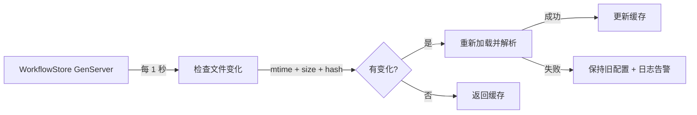
```mermaid
graph LR
    A[WorkflowStore GenServer] -->|每 1 秒| B[检查文件变化]
    B -->|mtime + size + hash| C{有变化?}
    C -->|是| D[重新加载并解析]
    C -->|否| E[返回缓存]
    D -->|成功| F[更新缓存]
    D -->|失败| G[保持旧配置 + 日志告警]
```

### 5.2 变化检测机制

使用三元组 `{mtime, size, hash}` 检测文件变化：

```elixir
defp current_stamp(path) do
  with {:ok, stat} <- File.stat(path, time: :posix),
       {:ok, content} <- File.read(path) do
    {:ok, {stat.mtime, stat.size, :erlang.phash2(content)}}
  end
end
```

- `mtime` — 文件修改时间
- `size` — 文件大小
- `hash` — 文件内容 hash（`:erlang.phash2`）

### 5.3 安全重载保证

- **无效重载不会 crash 服务** — 保持上一次有效配置继续运行
- **路径变化检测** — 如果 workflow 文件路径本身发生变化，也会触发重载
- **影响范围** — 重载后的配置应用于未来的 dispatch、retry 调度、hook 执行和 agent 启动
- **不影响进行中的 session** — 已启动的 Agent session 不会被自动重启

### 5.4 动态生效的配置项

以下配置项在 WORKFLOW.md 变更后**立即生效**（无需重启）：

| 配置项 | 说明 |
|--------|------|
| `polling.interval_ms` | 轮询间隔 |
| `agent.max_concurrent_agents` | 全局并发限制 |
| `agent.max_retry_backoff_ms` | 最大重试退避 |
| `tracker.active_states` / `terminal_states` | 活跃/终态状态列表 |
| `codex.*` | Codex 相关设置 |
| `hooks.*` | Workspace Hook 脚本和超时 |
| `workspace.root` | Workspace 根目录 |
| Prompt 模板正文 | 未来 run 使用新模板 |

---

## 6. WORKFLOW.md 实际示例

Symphony 自身的 WORKFLOW.md 是一个非常完整的参考示例（327 行），其 Prompt 模板涵盖了：

### 6.1 Prompt 结构要素

1. **Issue 上下文注入** — 使用 Liquid 变量插入 issue 元数据
2. **续跑上下文** — 根据 `attempt` 变量提供续跑指导
3. **状态路由** — 根据 issue 当前状态（Todo/In Progress/Human Review/Merging/Rework/Done）分别路由到不同流程
4. **工作笔记系统（Workpad）** — 定义标准化的进度跟踪模板
5. **技能引用（Skills）** — 引用 `.codex/skills/` 目录下的技能文件
6. **护栏规则（Guardrails）** — 定义 Agent 的行为边界
7. **完成标准（Completion Bar）** — 明确的质量门槛

### 6.2 Prompt 模板中的 Liquid 语法示例

```liquid
You are working on a Linear ticket `{{ issue.identifier }}`


Continuation context:
- This is retry attempt #{{ attempt }} because the ticket is still in an active state.


Issue context:
Identifier: {{ issue.identifier }}
Title: {{ issue.title }}
Current status: {{ issue.state }}
Labels: {{ issue.labels }}

Description:

{{ issue.description }}

No description provided.

```

---

## 7. 验证与错误分类

### 7.1 错误类型

| 错误类 | 说明 |
|--------|------|
| `missing_workflow_file` | WORKFLOW.md 文件不存在 |
| `workflow_parse_error` | YAML 解析失败 |
| `workflow_front_matter_not_a_map` | 前置数据不是 map |
| `template_parse_error` | Liquid 模板语法错误 |
| `template_render_error` | 未知变量/过滤器，非法插值 |

### 7.2 Dispatch 阻断行为

- **文件读取/YAML 错误** → 阻断所有新 dispatch，直到修复
- **模板错误** → 仅影响当前 run 尝试，其他 issue 不受影响

### 7.3 每 tick 预检验证

每个 dispatch 周期前进行的预检：
1. Workflow 文件可加载和解析
2. `tracker.kind` 存在且受支持
3. `tracker.api_key` 在 `$` 解析后存在
4. `tracker.project_slug` 存在
5. `codex.command` 存在且非空

---

## 8. 设计亮点总结

1. **单一文件即完整工作流** — Prompt + 配置 + Hooks 全部在一个文件中，自包含
2. **版本化管理** — 作为仓库代码的一部分，可 code review、git diff、回滚
3. **严格模板渲染** — 拒绝静默失败，拼写错误立即暴露
4. **热重载不停服** — 修改 WORKFLOW.md 后 1 秒内生效，无需重启服务
5. **安全降级** — 无效变更不会 crash，保持上次有效配置
6. **首轮/续跑分离** — 避免续跑时重复发送冗长 Prompt，节省 token

---

# 第八章：可观测性设计

## 概述

Symphony 提供了多层次的可观测性机制，让运维人员能够实时监控和调试多个并发 Agent 运行。可观测性层是**纯只读**的观察表面，不会影响编排器的正确性。

## 可观测性组件总览

| 组件 | 类型 | 文件 | 功能 |
|------|------|------|------|
| **结构化日志** | 必选 | 各模块 | 带上下文字段的 `key=value` 格式日志 |
| **StatusDashboard** | 可选 | `status_dashboard.ex` | 终端 TUI 实时仪表盘 |
| **Phoenix LiveView** | 可选 | `dashboard_live.ex` | Web 实时 Dashboard |
| **REST API** | 可选 | `observability_api_controller.ex` | JSON 接口供外部消费 |
| **Runtime Snapshot** | 推荐 | `orchestrator.ex` | 同步获取运行时状态快照 |

## 1. 结构化日志

### 1.1 必须包含的上下文字段

Symphony 对日志有严格的上下文要求：

**Issue 相关日志**：
- `issue_id` — 跟踪器内部 ID
- `issue_identifier` — 人类可读的 ticket key（如 `MT-649`）

**Agent 会话生命周期日志**：
- `session_id` — 由 `<thread_id>-<turn_id>` 组成

### 1.2 日志格式规范

```text
# 格式：稳定的 key=value 措辞
Agent task completed for issue_id=abc123 issue_identifier=MT-649 session_id=thread-1-turn-1
Issue stalled: issue_id=abc123 issue_identifier=MT-649 session_id=thread-1-turn-1 elapsed_ms=310000
Retrying issue_id=abc123 issue_identifier=MT-649 in 10000ms (attempt 2) error=agent exited: :timeout
```

### 1.3 日志级别使用规范

| 级别 | 使用场景 |
|------|---------|
| `info` | Agent dispatch、完成、状态转移 |
| `warning` | 异常退出、停滞检测、重试安排、hook 超时/失败 |
| `error` | 配置验证失败、workspace 创建失败、Codex 启动失败 |
| `debug` | 忽略的消息、非 JSON stderr 输出、状态刷新失败保持 worker |

### 1.4 日志安全要求

- **禁止**日志输出 API token 或秘密环境变量值
- Hook 输出在日志中截断（最大 2048 字节）
- Codex 流输出在日志中截断（最大 1000 字节）
- 日志 sink 失败**不能**导致编排器 crash

## 2. Runtime Snapshot（运行时快照）

### 2.1 快照机制

通过 Orchestrator GenServer 的 `handle_call(:snapshot, ...)` 实现同步快照获取：

```elixir
# 获取快照（超时 15 秒）
Orchestrator.snapshot()           # => %{} | :timeout | :unavailable
Orchestrator.snapshot(server, timeout)
```

### 2.2 快照数据结构

快照返回以下数据：

```elixir
%{
  running: [              # 正在运行的会话列表
    %{
      issue_id: "abc123",
      identifier: "MT-649",
      state: "In Progress",
      session_id: "thread-1-turn-1",
      codex_app_server_pid: "12345",
      codex_input_tokens: 1200,
      codex_output_tokens: 800,
      codex_total_tokens: 2000,
      turn_count: 7,
      started_at: ~U[2026-02-24 20:10:12Z],
      last_codex_timestamp: ~U[2026-02-24 20:14:59Z],
      last_codex_message: %{event: :notification, ...},
      last_codex_event: :notification,
      runtime_seconds: 287
    }
  ],
  retrying: [             # 重试队列列表
    %{
      issue_id: "def456",
      attempt: 3,
      due_in_ms: 4500,
      identifier: "MT-650",
      error: "no available orchestrator slots"
    }
  ],
  codex_totals: %{        # 聚合 Token 统计
    input_tokens: 5000,
    output_tokens: 2400,
    total_tokens: 7400,
    seconds_running: 1834
  },
  rate_limits: nil,       # 最新速率限制快照
  polling: %{             # 轮询状态
    checking?: false,
    next_poll_in_ms: 12000,
    poll_interval_ms: 30000
  }
}
```

### 2.3 快照错误模式

| 错误 | 含义 |
|------|------|
| `:timeout` | GenServer 调用超时（默认 15 秒） |
| `:unavailable` | Orchestrator 进程不存在 |

## 3. Token 统计与速率限制

### 3.1 Token 计数规则

Symphony 的 Token 统计采用**绝对值增量计算**，避免重复计数：

```
增量 = 当前报告绝对值 - 上次报告绝对值
```

**优先提取路径**（按优先级排列）：

1. `thread/tokenUsage/updated` 中的绝对线程总量
2. `params.msg.payload.info.total_token_usage` 深层嵌套路径
3. `params.tokenUsage.total` 路径
4. `turn/completed` 事件中的 `usage` 字段

**Token 字段名兼容**（宽容提取）：

```
input_tokens / prompt_tokens / inputTokens / promptTokens
output_tokens / completion_tokens / outputTokens / completionTokens
total_tokens / totalTokens / total
```

### 3.2 聚合统计

在 Orchestrator State 中维护 `codex_totals`：

```elixir
@empty_codex_totals %{
  input_tokens: 0,
  output_tokens: 0,
  total_tokens: 0,
  seconds_running: 0
}
```

- **Token 增量**：每次 Codex 事件到达时累加
- **运行时间**：会话结束时将 `DateTime.diff(now, started_at)` 累加到 `seconds_running`
- 快照时活跃会话的运行时间从 `started_at` 实时计算

### 3.3 速率限制追踪

跟踪 Agent 事件中最新的速率限制有效载荷：

```elixir
# 速率限制识别条件：
# 1. 包含 limit_id 或 limit_name 字段
# 2. 包含 primary / secondary / credits 桶之一
```

速率限制信息存储在 `state.codex_rate_limits` 中，每次收到新的速率限制事件时覆盖更新。

## 4. StatusDashboard（终端 TUI 仪表盘）

`StatusDashboard` 是一个 GenServer 进程，提供终端实时状态展示：

- 通过 `notify_update/0` 接收编排器状态变更通知
- 渲染当前运行的 Agent 会话列表
- 展示重试队列状态和倒计时
- 展示 Token 消耗汇总和速率限制信息
- 展示轮询状态（下次轮询倒计时）

### 驱动方式

StatusDashboard **不主动轮询**编排器，而是被动接收通知：

```elixir
# Orchestrator 在以下时机通知 Dashboard：
# - 每次 tick 完成
# - Worker 退出处理完成
# - Codex 事件更新
# - 重试触发

defp notify_dashboard do
  StatusDashboard.notify_update()
end
```

## 5. HTTP Server 与 Web Dashboard

### 5.1 启用条件

HTTP Server 是**可选扩展**，通过以下方式启用：

1. CLI `--port` 参数
2. `WORKFLOW.md` 中 `server.port` 配置

优先级：CLI `--port` > `server.port`

默认绑定 `127.0.0.1`（回环地址），确保安全。

### 5.2 Phoenix LiveView Dashboard (`/`)

- 路由：`GET /`
- 实现：`SymphonyElixirWeb.DashboardLive`
- 实时展示系统当前状态（活跃会话、重试延迟、Token 消耗、运行时总量、最近事件和健康指标）
- 基于 Phoenix LiveView 实现服务端推送实时更新

### 5.3 REST API 端点

提供 JSON REST API 供外部消费：

#### `GET /api/v1/state`

返回系统全局状态摘要：

```json
{
  "generated_at": "2026-02-24T20:15:30Z",
  "counts": { "running": 2, "retrying": 1 },
  "running": [
    {
      "issue_id": "abc123",
      "issue_identifier": "MT-649",
      "state": "In Progress",
      "session_id": "thread-1-turn-1",
      "turn_count": 7,
      "last_event": "turn_completed",
      "tokens": { "input_tokens": 1200, "output_tokens": 800, "total_tokens": 2000 }
    }
  ],
  "retrying": [
    {
      "issue_id": "def456",
      "issue_identifier": "MT-650",
      "attempt": 3,
      "due_at": "2026-02-24T20:16:00Z",
      "error": "no available orchestrator slots"
    }
  ],
  "codex_totals": {
    "input_tokens": 5000, "output_tokens": 2400,
    "total_tokens": 7400, "seconds_running": 1834.2
  },
  "rate_limits": null
}
```

#### `GET /api/v1/<issue_identifier>`

返回指定 Issue 的运行时调试详情：

```json
{
  "issue_identifier": "MT-649",
  "status": "running",
  "workspace": { "path": "/tmp/symphony_workspaces/MT-649" },
  "running": {
    "session_id": "thread-1-turn-1",
    "turn_count": 7,
    "tokens": { "input_tokens": 1200, "output_tokens": 800, "total_tokens": 2000 }
  },
  "recent_events": [
    { "at": "2026-02-24T20:14:59Z", "event": "notification", "message": "Working on tests" }
  ]
}
```

- Issue 不存在时返回 `404`：`{"error": {"code": "issue_not_found", "message": "..."}}`

#### `POST /api/v1/refresh`

触发即时轮询 + 协调周期：

```json
// 响应 202 Accepted
{
  "queued": true,
  "coalesced": false,
  "requested_at": "2026-02-24T20:15:30Z",
  "operations": ["poll", "reconcile"]
}
```

- 重复请求可能被合并（`coalesced: true`）
- 不支持的 HTTP 方法返回 `405 Method Not Allowed`
- API 错误统一使用 `{"error": {"code": "...", "message": "..."}}` 格式

## 6. 可观测性设计原则

### 6.1 只读原则

所有可观测性组件（Dashboard、API、日志）都是**只读表面**：

- 从编排器状态/指标中获取数据
- 不影响编排器的正确性
- Dashboard 失败不会导致编排器 crash

### 6.2 实时性

- StatusDashboard 由编排器事件驱动，非轮询
- LiveView 使用 WebSocket 推送，实时更新
- REST API 提供同步快照，数据即时准确

### 6.3 容错性

```text
可观测性失败处理策略：
├── 快照超时 → 返回 :timeout，编排器继续运行
├── Dashboard 渲染错误 → 记录日志，编排器继续运行
├── 日志 Sink 失败 → 通过其他可用 Sink 告警，编排器继续运行
└── HTTP Server 端口变更 → 需要重启服务（符合规范）
```

## 7. 可观测性数据流图

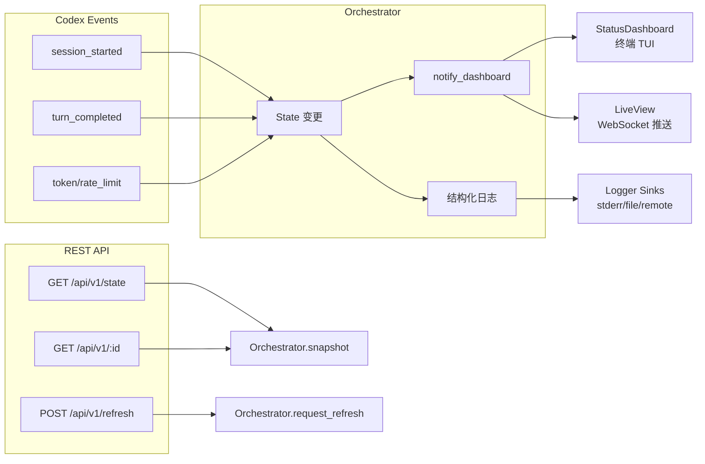
```mermaid
graph LR
    subgraph Orchestrator
        A[State 变更] --> B[notify_dashboard]
        A --> C[结构化日志]
    end

    subgraph Codex Events
        D[session_started] --> A
        E[turn_completed] --> A
        F[token/rate_limit] --> A
    end

    B --> G[StatusDashboard<br/>终端 TUI]
    B --> H[LiveView<br/>WebSocket 推送]

    subgraph REST API
        I[GET /api/v1/state]
        J[GET /api/v1/:id]
        K[POST /api/v1/refresh]
    end

    I --> L[Orchestrator.snapshot]
    J --> L
    K --> M[Orchestrator.request_refresh]

    C --> N[Logger Sinks<br/>stderr/file/remote]
```

## 相关文件

| 文件 | 说明 |
|------|------|
| `elixir/lib/symphony_elixir/orchestrator.ex` | 快照接口 `snapshot/0`、`request_refresh/0` |
| `elixir/lib/symphony_elixir/status_dashboard.ex` | 终端 TUI 仪表盘 |
| `elixir/lib/symphony_elixir_web/dashboard_live.ex` | Phoenix LiveView Dashboard |
| `elixir/lib/symphony_elixir_web/observability_api_controller.ex` | REST API 控制器 |
| `elixir/lib/symphony_elixir/http_server.ex` | HTTP 服务器启动 |
| `SPEC.md` Section 13 | 可观测性规范定义 |

---

# 附录：实战场景 — 10 个 Issue 的调度过程

通过一个具体的例子来展示 Symphony 如何处理独立任务、有阻塞依赖的任务、以及各种异常情况。

## 场景设定

假设一个团队有以下 10 个 Issue，WORKFLOW.md 配置为：

```yaml
agent:
  max_concurrent_agents: 3          # 全局最多同时 3 个 Agent
  max_turns: 5                      # 每个 session 最多 5 个 turn
  max_retry_backoff_ms: 300000      # 最大重试退避 5 分钟
  max_concurrent_agents_by_state:
    todo: 2                         # Todo 状态最多 2 个并发
    in progress: 3                  # In Progress 状态最多 3 个并发

tracker:
  active_states: [Todo, In Progress]
  terminal_states: [Done, Closed, Cancelled]
```

## Issue 清单

| Issue | 标题 | 状态 | 优先级 | 创建时间 | Blocker（阻塞依赖） |
|-------|------|------|--------|---------|---------------------|
| MT-101 | 用户登录页面 | In Progress | 1（紧急） | 1月1日 | 无 |
| MT-102 | 支付接口对接 | In Progress | 2（高） | 1月2日 | 无 |
| MT-103 | 数据导出功能 | Todo | 2（高） | 1月3日 | 无 |
| MT-104 | 搜索优化 | Todo | 3（中） | 1月4日 | 无 |
| MT-105 | 写单元测试 | Todo | 3（中） | 1月5日 | **被 MT-101 阻塞** |
| MT-106 | 部署脚本 | Todo | 4（低） | 1月6日 | **被 MT-102 阻塞** |
| MT-107 | UI 美化 | Done | 3（中） | 1月7日 | 无 |
| MT-108 | 性能监控 | Closed | 4（低） | 1月8日 | 无 |
| MT-109 | 紧急修复 Bug | In Progress | 1（紧急） | 1月9日 | 无 |
| MT-110 | 文档更新 | Backlog | 4（低） | 1月10日 | 无 |

其中：
- **独立任务**：MT-101~104、MT-109 互相不依赖，可以独立执行
- **有阻塞依赖的任务**：MT-105 依赖 MT-101，MT-106 依赖 MT-102
- **已完成/终态**：MT-107（Done）、MT-108（Closed）不会被调度
- **不在活跃状态列表中**：MT-110（Backlog）不会被调度

## Tick 1（T=0s）：首次轮询

### Step 1: Reconciliation
无运行中的 issue，跳过。

### Step 2: Fetch 候选 Issues
从 Linear 获取 `active_states`（Todo, In Progress）中的 issue：

| Issue | 是否候选 | 原因 |
|-------|---------|------|
| MT-101 | ✅ | In Progress，活跃状态 |
| MT-102 | ✅ | In Progress，活跃状态 |
| MT-103 | ✅ | Todo，活跃状态 |
| MT-104 | ✅ | Todo，活跃状态 |
| MT-105 | ✅ | Todo，活跃状态（但有 Blocker） |
| MT-106 | ✅ | Todo，活跃状态（但有 Blocker） |
| MT-107 | ❌ | Done → 终态，不符合 |
| MT-108 | ❌ | Closed → 终态，不符合 |
| MT-109 | ✅ | In Progress，活跃状态 |
| MT-110 | ❌ | Backlog → 不在 active_states 中 |

### Step 3: Sort 排序
按 `priority 升序 → created_at 最早 → identifier 字典序`：

```
1. MT-101（P1, 1月1日）    ← 最高优先级 + 最早创建
2. MT-109（P1, 1月9日）    ← 同优先级，创建较晚
3. MT-102（P2, 1月2日）
4. MT-103（P2, 1月3日）
5. MT-104（P3, 1月4日）
6. MT-105（P3, 1月5日）    ← 被 MT-101 阻塞
7. MT-106（P4, 1月6日）    ← 被 MT-102 阻塞
```

### Step 4: Dispatch
逐一检查并分配（全局上限 3 个）：

| 候选 | 检查结果 | 动作 |
|------|---------|------|
| MT-101 | ✅ In Progress, 无阻塞, IP 槽位 0/3 | **Dispatch** → running 1/3 |
| MT-109 | ✅ In Progress, 无阻塞, IP 槽位 1/3 | **Dispatch** → running 2/3 |
| MT-102 | ✅ In Progress, 无阻塞, IP 槽位 2/3 | **Dispatch** → running 3/3（全局满） |
| MT-103 | ❌ 全局槽位已满 (3/3) | 等待下次 tick |
| MT-104~106 | ❌ 全局槽位已满 | 等待 |

**Tick 1 结果**：3 个 Agent 开始工作

```
running:   {MT-101, MT-109, MT-102}
claimed:   {MT-101, MT-109, MT-102}
available: 0
```

> 💡 注意：MT-109 虽然创建时间比 MT-102 晚，但因为优先级更高（P1 > P2），排在 MT-102 前面。

## Tick 2（T=30s）：MT-109 快速完成

假设 MT-109（紧急修复 Bug）任务简单，Agent 在 Turn 2 就完成了——通过 Linear 工具将 Issue 标记为 Done。

### Step 1: Reconciliation
- MT-101：仍在运行，`last_codex_timestamp` 更新正常 → 继续
- MT-102：仍在运行 → 继续
- MT-109：Tracker 刷新发现状态变为 **Done**（终态）→ **终止 Worker + 清理 Workspace**

```
running:   {MT-101, MT-102}     ← MT-109 已移除
claimed:   {MT-101, MT-102}     ← MT-109 claim 释放
available: 1
```

### Step 2: Fetch + Sort + Dispatch
现在有 1 个空槽位，重新获取候选列表并调度：

| 候选 | 检查结果 | 动作 |
|------|---------|------|
| MT-103 | ✅ Todo, 无阻塞, Todo 槽位 0/2 | **Dispatch** → running 3/3（全局满） |
| MT-104 | ❌ 全局槽位已满 | 等待 |
| MT-105 | ❌ **被 MT-101 阻塞**（MT-101 仍是 In Progress，非终态）+ 全局满 | 等待 |
| MT-106 | ❌ **被 MT-102 阻塞** + 全局满 | 等待 |

**Tick 2 结果**：

```
running: {MT-101, MT-102, MT-103}
```

## Tick 3（T=60s）：MT-101 Worker 达到 max_turns

MT-101 的 Worker 在第 5 个 Turn 后正常退出（达到 max_turns=5），但 Issue 仍是 In Progress——说明任务还没完成。

### Orchestrator 收到 Worker `:normal` 退出
1. 将 MT-101 记录到 `completed` 集合（仅记账）
2. 安排 **1 秒后 continuation retry**
3. MT-101 保持在 `claimed` 中（防止下次 tick 重复 dispatch）

### T=61s: Continuation Retry 触发
1. 重新查询 MT-101 → 仍是 In Progress（活跃）
2. 有可用槽位（MT-101 的旧 Worker 已退出）→ **重新 Dispatch**
3. 新的 Session 启动，**复用同一个 Workspace**（之前写的代码都还在）
4. 新 Session 的 Turn 1 发送完整 Prompt，但 Agent 可以从 Workspace 和 Workpad 中看到之前的工作进度

```
running: {MT-101(新session), MT-102, MT-103}
```

> 💡 这就是"续跑"的核心机制——达到 max_turns 后不是放弃，而是开启新的 Session 继续工作。

## Tick 4（T=90s）：MT-102 Agent 崩溃

MT-102 的 Codex 子进程意外崩溃（异常退出）。

### Orchestrator 收到 Worker 非正常退出
1. MT-102 从 `running` 中移除
2. 安排 **指数退避重试**：attempt=1, delay=10s
3. MT-102 保持在 `claimed` 中

### T=100s: Retry 触发
1. 查询 MT-102 → 仍是 In Progress（活跃）
2. 有可用槽位 → **重新 Dispatch**
3. 新的 Worker 在**同一个 Workspace** 中启动

> 💡 如果再次崩溃，下一次重试延迟将是 20s（attempt=2），然后 40s、80s...最大 300s。

## Tick 5（T=120s）：MT-101 完成，Blocker 解除

MT-101（用户登录页面）在续跑 Session 中成功完成，Agent 将 Issue 标记为 Done。

### Reconciliation
MT-101 变为 Done → 终止 Worker + 清理 Workspace

**此时 MT-105 的 Blocker（MT-101）已进入终态！**

### Dispatch

| 候选 | 检查结果 | 动作 |
|------|---------|------|
| MT-104 | ✅ Todo, 无阻塞, Todo 槽位 0/2 | **Dispatch** |
| MT-105 | ✅ Todo, **MT-101 已 Done（终态）→ Blocker 解除** ✅, Todo 槽位 1/2 | **Dispatch** |
| MT-106 | ❌ 全局槽位已满 + **MT-102 仍非终态** | 等待 |

```
running: {MT-102, MT-103, MT-104}   ← 全局满（3/3）
```

> ⚠️ MT-105 因为全局槽位已满（3/3），虽然 Blocker 解除了，但还需等到有空位。在下一次有 Agent 完成释放槽位时才能被调度。

## 后续演进

经过多轮 Tick 后（MT-103 完成释放槽位 → MT-105 被调度 → MT-102 完成释放 MT-106 的 Blocker → MT-106 被调度），最终结局：

| Issue | 最终状态 | 说明 |
|-------|---------|------|
| MT-101 | ✅ Done | 首次达到 max_turns 后自动续跑，在第二个 Session 中完成 |
| MT-102 | ✅ Done | 崩溃后自动重试（指数退避），最终完成 |
| MT-103 | ✅ Done | 正常完成 |
| MT-104 | ✅ Done | 等待槽位后完成 |
| MT-105 | ✅ Done | 等待 Blocker MT-101 完成 + 等待槽位后被调度并完成 |
| MT-106 | ✅ Done | 等待 Blocker MT-102 完成 + 等待槽位后被调度并完成 |
| MT-107 | — | 已是 Done，Symphony 不处理（启动时清理其 Workspace） |
| MT-108 | — | 已是 Closed，Symphony 不处理（启动时清理其 Workspace） |
| MT-109 | ✅ Done | 紧急任务，P1 优先调度，2 个 Turn 快速完成 |
| MT-110 | ⏸ Backlog | 不在 `active_states` 中，Symphony 完全不调度 |

## 场景总结：Symphony 展示的核心能力

| 能力 | 体现 |
|------|------|
| **优先级调度** | P1 的 MT-101 和 MT-109 最先被 dispatch，排在 P2 的 MT-102 前面 |
| **并发控制** | 全局最多 3 个 Agent，Todo 最多 2 个，绝不超载 |
| **Blocker 感知** | MT-105 等待 MT-101 完成后才能被调度（Todo 状态 + 非终态 Blocker = 不可调度） |
| **自动续跑** | MT-101 达到 max_turns=5 后自动开启新 Session 继续工作 |
| **故障恢复** | MT-102 崩溃后自动指数退避重试，无需人工干预 |
| **状态驱动释放** | MT-109 完成后自动释放槽位给排队中的 MT-103 |
| **终态清理** | 完成的 Issue 自动清理 Workspace，回收磁盘空间 |
| **非活跃忽略** | MT-110（Backlog）不在活跃状态列表中，被完全忽略 |
| **Workspace 持久性** | MT-101 续跑时 Workspace 中保留了之前 Session 的代码变更 |
| **Claim 防重复** | 重试等待期间，MT-102 的 claim 防止它被 tick 重复调度 |

---

# 附录二：Symphony Agent Protocol 详解 — JSON-RPC 协议设计

## 1. 协议总览图

下图展示了 Symphony 与 Agent（Codex）之间的完整通信协议：

```
┌─────────────────────────────────────────────────────────────┐
│                   Symphony Agent Protocol                    │
│                                                              │
│   Symphony ───────────────────────────► Agent (Codex)        │
│                                                              │
│   1. initialize        →    "我准备好了"                     │
│   2. thread/start      →    "会话已创建"                     │
│   3. turn/start(prompt)→    "开始干活"                       │
│                                                              │
│   ◄── requestApproval       "我想执行 rm -rf，可以吗？"     │
│   ──► approve/reject        "批准" / "拒绝"                 │
│                                                              │
│   ◄── turn/completed        "这轮做完了"                     │
│   ──► turn/start(继续)      "再来一轮"                       │
│   ──► (关闭 port)           "收工"                           │
│                                                              │
│   全程双向通信，Symphony 完全控制 Agent 的生命周期            │
└─────────────────────────────────────────────────────────────┘
```

这是一个**主从式（Master-Slave）双向通信协议**：
- **Symphony 是主控方**：负责启动、握手、发送任务、审批/拒绝、关闭
- **Agent 是从属方**：被动响应请求，主动上报事件（如请求审批、完成通知）

## 2. 协议基础：JSON-RPC 2.0 over stdio

### 2.1 什么是 JSON-RPC

JSON-RPC 是一种轻量级的远程过程调用（RPC）协议，使用 JSON 作为数据格式。Symphony 采用的是 **JSON-RPC 2.0** 规范的变体。

每条消息都是一个 JSON 对象，通过**换行符分隔**（line-delimited），一行一条完整消息。

**三种消息类型**：

| 类型 | 结构 | 说明 |
|------|------|------|
| **Request（请求）** | `{"id": 1, "method": "xxx", "params": {...}}` | 需要对方回复，`id` 用于匹配响应 |
| **Response（响应）** | `{"id": 1, "result": {...}}` | 匹配对应 `id` 的请求 |
| **Notification（通知）** | `{"method": "xxx", "params": {...}}` | 无 `id`，不需要回复 |

### 2.2 传输层：stdio（标准输入/输出）

```
Symphony 进程                     Codex 子进程
    │                                  │
    │ ──── stdin (写) ───────────────► │  Symphony 发消息给 Codex
    │                                  │
    │ ◄──── stdout (读) ────────────── │  Codex 回消息给 Symphony
    │                                  │
    │ ◄──── stderr (诊断) ──────────── │  仅用于日志诊断，不是协议
    │                                  │
```

- **stdout** 专用于协议消息（JSON-RPC）
- **stderr** 仅用于诊断日志，**不参与协议解析**
- 行分隔：每行一个完整 JSON 消息，以 `\n` 分隔
- 最大行缓冲：1MB（Elixir 实现中 `@port_line_bytes 1_048_576`）

## 3. 完整协议流程详解

### 3.1 Phase 1：启动与握手（Handshake）

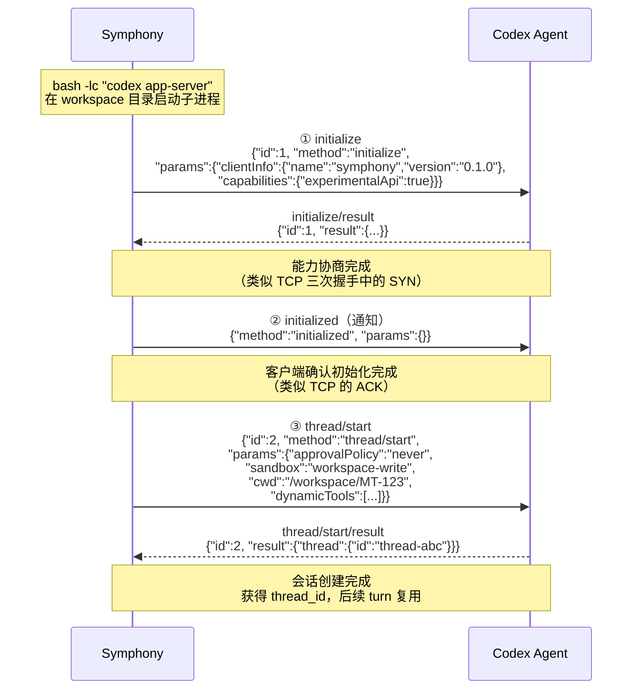
```mermaid
sequenceDiagram
    participant S as Symphony
    participant C as Codex Agent

    Note over S: bash -lc "codex app-server"<br/>在 workspace 目录启动子进程

    S->>C: ① initialize<br/>{"id":1, "method":"initialize",<br/>"params":{"clientInfo":{"name":"symphony","version":"0.1.0"},<br/>"capabilities":{"experimentalApi":true}}}
    C-->>S: initialize/result<br/>{"id":1, "result":{...}}
    Note over S,C: 能力协商完成<br/>（类似 TCP 三次握手中的 SYN）

    S->>C: ② initialized（通知）<br/>{"method":"initialized", "params":{}}
    Note over S,C: 客户端确认初始化完成<br/>（类似 TCP 的 ACK）

    S->>C: ③ thread/start<br/>{"id":2, "method":"thread/start",<br/>"params":{"approvalPolicy":"never",<br/>"sandbox":"workspace-write",<br/>"cwd":"/workspace/MT-123",<br/>"dynamicTools":[...]}}
    C-->>S: thread/start/result<br/>{"id":2, "result":{"thread":{"id":"thread-abc"}}}
    Note over S,C: 会话创建完成<br/>获得 thread_id，后续 turn 复用
```

**每一步的设计意图**：

| 步骤 | 方法 | 设计意图 |
|------|------|---------|
| ① `initialize` | Request（id=1） | **能力协商**：声明客户端身份（name/version）和支持的能力（如 experimentalApi），让 Agent 知道对方是谁、支持什么特性 |
| ② `initialized` | Notification（无 id） | **确认信号**：告知 Agent 客户端已完成自身初始化，可以开始正式通信。这是一个单向通知，不需要回复 |
| ③ `thread/start` | Request（id=2） | **会话创建**：建立一个有状态的会话线程，传递安全策略（审批策略、沙箱模式）、工作目录、以及可用的动态工具列表 |

### 3.2 Phase 2：任务执行（Turn Processing）

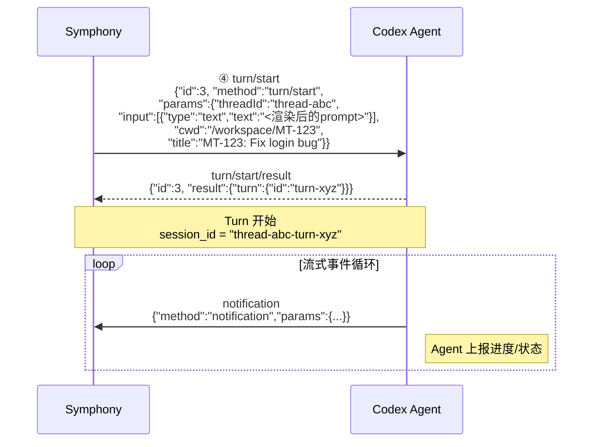
```mermaid
sequenceDiagram
    participant S as Symphony
    participant C as Codex Agent

    S->>C: ④ turn/start<br/>{"id":3, "method":"turn/start",<br/>"params":{"threadId":"thread-abc",<br/>"input":[{"type":"text","text":"<渲染后的prompt>"}],<br/>"cwd":"/workspace/MT-123",<br/>"title":"MT-123: Fix login bug"}}
    C-->>S: turn/start/result<br/>{"id":3, "result":{"turn":{"id":"turn-xyz"}}}
    Note over S,C: Turn 开始<br/>session_id = "thread-abc-turn-xyz"

    loop 流式事件循环
        C->>S: notification<br/>{"method":"notification","params":{...}}
        Note right of C: Agent 上报进度/状态
    end
```

**Turn 的核心参数**：

| 参数 | 说明 |
|------|------|
| `threadId` | 复用之前 `thread/start` 返回的 thread ID，保持上下文连续性 |
| `input` | 文本数组，首轮为完整渲染的 Prompt，续跑轮为 continuation guidance |
| `cwd` | 工作目录绝对路径 |
| `title` | `<issue.identifier>: <issue.title>`，用于 Agent 显示 |
| `approvalPolicy` | Turn 级审批策略 |
| `sandboxPolicy` | Turn 级沙箱策略 |

### 3.3 Phase 3：审批交互（Approval Loop）

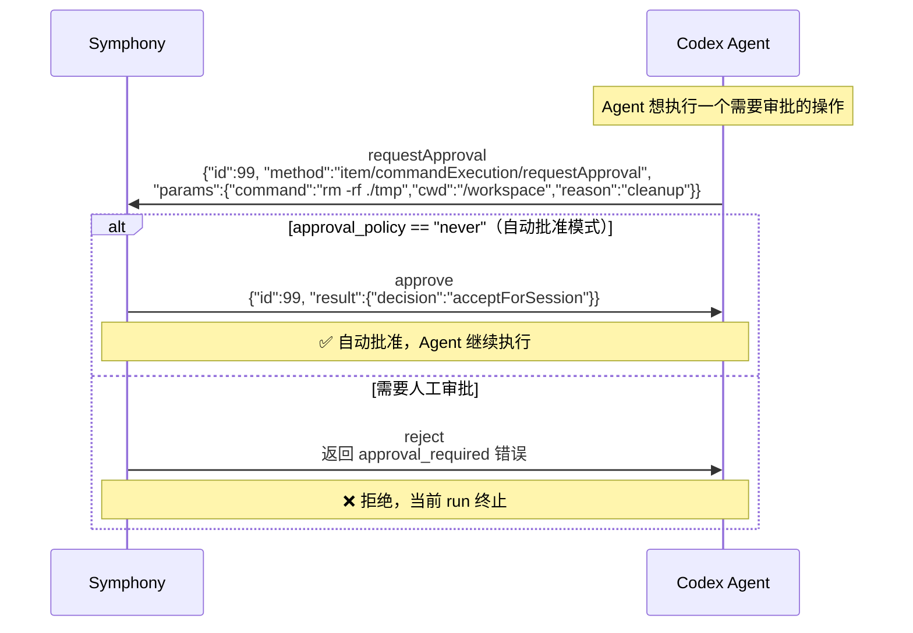
```mermaid
sequenceDiagram
    participant S as Symphony
    participant C as Codex Agent

    Note over C: Agent 想执行一个需要审批的操作

    C->>S: requestApproval<br/>{"id":99, "method":"item/commandExecution/requestApproval",<br/>"params":{"command":"rm -rf ./tmp","cwd":"/workspace","reason":"cleanup"}}

    alt approval_policy == "never"（自动批准模式）
        S->>C: approve<br/>{"id":99, "result":{"decision":"acceptForSession"}}
        Note over S,C: ✅ 自动批准，Agent 继续执行
    else 需要人工审批
        S->>C: reject<br/>返回 approval_required 错误
        Note over S,C: ❌ 拒绝，当前 run 终止
    end
```

**审批消息类型与响应**：

| Agent 请求方法 | 含义 | 自动批准时的响应 |
|---------------|------|-----------------|
| `item/commandExecution/requestApproval` | 请求执行 shell 命令 | `{"decision": "acceptForSession"}` |
| `execCommandApproval` | 请求执行命令（旧版） | `{"decision": "approved_for_session"}` |
| `applyPatchApproval` | 请求应用代码补丁 | `{"decision": "approved_for_session"}` |
| `item/fileChange/requestApproval` | 请求修改文件 | `{"decision": "acceptForSession"}` |
| `item/tool/requestUserInput` | 请求用户输入 | 尝试自动选择"Approve this Session" |
| `item/tool/call` | 调用动态工具 | 执行工具并返回结果 |

### 3.4 Phase 4：Turn 完成与续跑

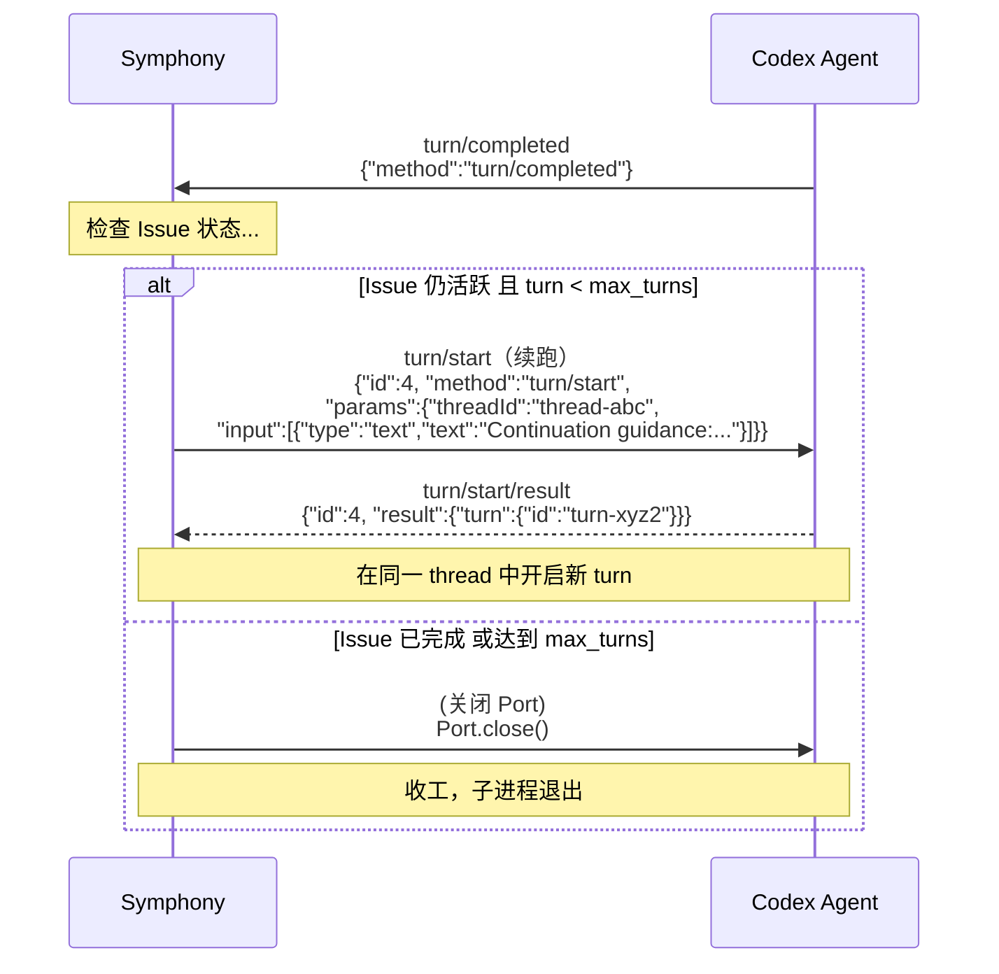
```mermaid
sequenceDiagram
    participant S as Symphony
    participant C as Codex Agent

    C->>S: turn/completed<br/>{"method":"turn/completed"}
    Note over S: 检查 Issue 状态...

    alt Issue 仍活跃 且 turn < max_turns
        S->>C: turn/start（续跑）<br/>{"id":4, "method":"turn/start",<br/>"params":{"threadId":"thread-abc",<br/>"input":[{"type":"text","text":"Continuation guidance:..."}]}}
        C-->>S: turn/start/result<br/>{"id":4, "result":{"turn":{"id":"turn-xyz2"}}}
        Note over S,C: 在同一 thread 中开启新 turn
    else Issue 已完成 或达到 max_turns
        S->>C: (关闭 Port)<br/>Port.close()
        Note over S,C: 收工，子进程退出
    end
```

**Turn 完成条件**：

| 消息/事件 | 含义 |
|----------|------|
| `turn/completed` | ✅ Turn 成功完成 |
| `turn/failed` | ❌ Turn 失败 |
| `turn/cancelled` | ❌ Turn 被取消 |
| `turn_timeout_ms` 超时 | ❌ Turn 超时（默认 1 小时） |
| 子进程退出 | ❌ Codex 崩溃 |

### 3.5 Phase 5：会话结束

```
Symphony 关闭 Port → Codex 子进程收到 stdin EOF → 自行退出
```

- 不需要显式的"关闭"消息
- Port 关闭后子进程自然终止
- 多个 Turn 之间 Port 保持存活，子进程不重启

## 4. 为什么选择 JSON-RPC over stdio？

### 4.1 为什么是 JSON-RPC（而不是 REST/gRPC/WebSocket）

| 维度 | JSON-RPC over stdio | REST API | gRPC | WebSocket |
|------|---------------------|----------|------|-----------|
| **启动开销** | 零（子进程 + 管道） | 需要 HTTP 服务器 | 需要 HTTP/2 服务器 | 需要 HTTP 升级 |
| **双向通信** | ✅ 天然双向（stdin/stdout） | ❌ 单向（需轮询或 SSE） | ✅ 流式 | ✅ 全双工 |
| **进程隔离** | ✅ 独立子进程 | 需要额外进程管理 | 需要额外进程管理 | 需要额外进程管理 |
| **复杂度** | 极低（每行一个 JSON） | 中等 | 高（需要 protobuf） | 中等 |
| **端口管理** | 不需要（无网络） | 需要端口分配/冲突处理 | 需要端口 | 需要端口 |
| **多实例** | 天然隔离（每个子进程独立） | 需要端口动态分配 | 同上 | 同上 |
| **安全性** | 无网络暴露 | 需要认证/防火墙 | 需要 TLS | 需要认证 |
| **协议先例** | LSP（Language Server Protocol）| — | — | — |

**核心理由**：

1. **零基础设施**：不需要端口、不需要 HTTP 服务器、不需要证书，一个 `bash -lc` 就启动了
2. **天然进程隔离**：每个 Agent 是独立子进程，崩溃不影响 Symphony 主进程（在 Elixir 中通过 Port 实现，而非 NIF，确保 BEAM VM 安全）
3. **天然双向通信**：stdin/stdout 本身就是双向管道，Agent 可以主动上报事件（如请求审批），Symphony 可以主动发送命令
4. **多实例无冲突**：10 个 Agent 并发 = 10 个子进程 × 10 对管道，互不干扰，无端口冲突
5. **LSP 先例验证**：VS Code 的 Language Server Protocol 已经证明了 JSON-RPC over stdio 在"宿主控制子进程"场景下的可靠性

### 4.2 为什么是 stdio（而不是 TCP/Unix Socket）

```
stdio 方式：
  Symphony → fork() → Codex 子进程
  通过 stdin/stdout 管道通信
  ✅ 无需端口分配、无网络、无认证

TCP 方式：
  Symphony → 分配端口 → Codex 监听端口 → Symphony 连接
  通过 TCP 连接通信
  ❌ 端口冲突风险、需要服务发现、需要健康检查
```

**stdio 的优势**：

| 特性 | 说明 |
|------|------|
| **原子性启动** | 子进程启动 = 通信通道建立，一步到位 |
| **生命周期绑定** | Port 关闭 = 子进程退出，无需额外的心跳/健康检查 |
| **无资源泄露** | 不存在"端口占用但进程已死"的问题 |
| **零配置** | 不需要找空闲端口、不需要配置地址 |
| **安全隔离** | 通信通道完全在进程间，不暴露到网络 |

### 4.3 为什么这种四步握手设计

```
initialize → initialized → thread/start → turn/start
```

这个四步握手的设计类似于 **LSP 的初始化协议**，每一步都有明确的目的：

| 步骤 | 类比 | 为什么需要这一步 |
|------|------|-----------------|
| `initialize` | TCP SYN | **能力协商**：双方交换版本和支持的能力，确保兼容性。如果 Agent 不支持某个 API 版本，可以在这一步就快速失败 |
| `initialized` | TCP ACK | **确认就绪**：告诉 Agent "我已经准备好了，可以开始了"。这是一个 Notification（无需回复），减少一次往返 |
| `thread/start` | HTTP 建立会话 | **会话初始化**：创建有状态上下文（线程），传递安全策略（审批策略、沙箱模式、动态工具列表）。返回 `thread_id` 供后续复用 |
| `turn/start` | HTTP 发送请求 | **任务下发**：在已建立的会话中发送具体任务。可在同一 thread 中多次调用，实现多轮对话 |

**为什么不合并成一步？**

如果把这四步合成一个大 JSON 消息，会导致：
- 无法区分"能力不兼容"和"任务执行失败"——错误诊断困难
- 无法在同一会话中多次执行任务（续跑时需要复用 thread，只需要新的 `turn/start`）
- 无法在 thread 级别设置安全策略、在 turn 级别设置不同的任务参数

**分层设计的好处**：

```
initialize  ← 进程级别（一次性）：我是谁、我能做什么
thread/start ← 会话级别（一次性）：安全策略、工作目录
turn/start   ← 任务级别（可重复）：具体的 prompt 和参数
```

### 4.4 为什么 Symphony 需要完全控制 Agent 生命周期

```
Symphony 的控制权：
  ✅ 启动 Agent（fork 子进程）
  ✅ 发送任务（turn/start）
  ✅ 审批/拒绝操作（approve/reject）
  ✅ 续跑决策（检查 Issue 状态后决定是否继续）
  ✅ 终止 Agent（Port.close）

Agent 的自主权：
  ✅ 执行具体的编码工作（在沙箱内）
  ✅ 主动请求审批（requestApproval）
  ✅ 主动上报进度（notification）
  ❌ 不能自己决定是否继续（由 Symphony 决定）
  ❌ 不能自己修改 Issue 调度策略
```

这种**完全控制设计**的理由：

1. **防止 Agent 失控**：Agent 由 LLM 驱动，行为不完全可预测。如果 Agent 能自己决定继续执行，可能无限循环消耗资源
2. **外部状态驱动**：Symphony 在每个 Turn 结束后查询 Issue Tracker 的最新状态，确保 Agent 行为与外部现实一致（比如 Issue 被人工关闭了，Agent 应该立即停止）
3. **资源隔离**：通过 Port（进程隔离），即使 Codex 崩溃（内存溢出、死循环），Symphony 主进程（BEAM VM）不受影响
4. **统一调度**：多个 Agent 的资源分配（并发数、优先级）由 Orchestrator 统一管理，Agent 无权抢占

### 4.5 与 MCP（Model Context Protocol）的对比

MCP 和 Symphony Agent Protocol 看似类似（都是 JSON-RPC over stdio），但定位完全不同：

| 维度 | Symphony Agent Protocol | MCP |
|------|------------------------|-----|
| **关系** | 主从关系（Symphony 控制 Agent） | 对等关系（Host 使用 Server 的工具） |
| **通信方向** | 双向：Symphony 发命令 + Agent 请求审批 | 双向：Host 调工具 + Server 提供资源 |
| **生命周期** | Symphony 完全控制 Agent 生命周期 | Host 启动 Server，但 Server 是独立服务 |
| **核心概念** | Thread → Turn → Approval | Tool → Resource → Prompt |
| **状态管理** | 有状态（thread_id 贯穿多个 turn） | 相对无状态（每次工具调用独立） |
| **设计目标** | 编排自主编码 Agent 完成复杂任务 | 让 LLM 获取外部工具和数据源 |

**简单类比**：
- MCP 像是"给 LLM 装插件"（工具箱模式）
- Symphony Agent Protocol 像是"给 Agent 下达任务并监工"（指挥模式）

## 5. 协议消息完整参考

### 5.1 握手阶段消息

```json
// ① initialize 请求
{"id":1, "method":"initialize", "params":{
  "clientInfo":{"name":"symphony-orchestrator","title":"Symphony Orchestrator","version":"0.1.0"},
  "capabilities":{"experimentalApi":true}
}}

// ① initialize 响应
{"id":1, "result":{}}

// ② initialized 通知（无 id，无需响应）
{"method":"initialized", "params":{}}

// ③ thread/start 请求
{"id":2, "method":"thread/start", "params":{
  "approvalPolicy":"never",
  "sandbox":"workspace-write",
  "cwd":"/abs/path/to/workspace/MT-123",
  "dynamicTools":[{"name":"linear_graphql","description":"...","inputSchema":{...}}]
}}

// ③ thread/start 响应
{"id":2, "result":{"thread":{"id":"thread-abc-123"}}}
```

### 5.2 Turn 执行阶段消息

```json
// ④ turn/start 请求（首轮 — 完整 prompt）
{"id":3, "method":"turn/start", "params":{
  "threadId":"thread-abc-123",
  "input":[{"type":"text","text":"You are working on Linear ticket MT-123...\n\nIssue context:\nTitle: Fix login timeout bug\n..."}],
  "cwd":"/abs/path/to/workspace/MT-123",
  "title":"MT-123: Fix login timeout bug",
  "approvalPolicy":"never",
  "sandboxPolicy":{"type":"workspaceWrite"}
}}

// ④ turn/start 响应
{"id":3, "result":{"turn":{"id":"turn-xyz-456"}}}

// ④ turn/start 请求（续跑轮 — continuation guidance）
{"id":4, "method":"turn/start", "params":{
  "threadId":"thread-abc-123",
  "input":[{"type":"text","text":"Continuation guidance:\n- This is continuation turn #2 of 20...\n- Resume from the current workspace state..."}],
  "cwd":"/abs/path/to/workspace/MT-123",
  "title":"MT-123: Fix login timeout bug",
  "approvalPolicy":"never",
  "sandboxPolicy":{"type":"workspaceWrite"}
}}
```

### 5.3 流式事件消息

```json
// Agent 上报通知（进度、状态等）
{"method":"notification", "params":{"message":"Working on implementing login form..."}}

// Agent 请求执行命令的审批
{"id":99, "method":"item/commandExecution/requestApproval", "params":{
  "command":"npm test",
  "cwd":"/workspace/MT-123",
  "reason":"running tests"
}}

// Symphony 批准（自动模式）
{"id":99, "result":{"decision":"acceptForSession"}}

// Agent 请求调用动态工具
{"id":100, "method":"item/tool/call", "params":{
  "name":"linear_graphql",
  "arguments":{"query":"mutation { issueUpdate(id: \"...\", input: {stateId: \"...\"}) { success } }"}
}}

// Symphony 返回工具调用结果
{"id":100, "result":{"success":true, "data":{...}}}

// Turn 完成通知
{"method":"turn/completed"}

// Turn 失败通知
{"method":"turn/failed", "params":{"reason":"..."}}
```

### 5.4 Session ID 构成规则

```
session_id = "<thread_id>-<turn_id>"

示例：
  thread_id = "thread-abc-123"    （来自 thread/start 的响应）
  turn_id   = "turn-xyz-456"      （来自 turn/start 的响应）
  session_id = "thread-abc-123-turn-xyz-456"
```

- 同一 Worker run 内所有 Turn 共享相同的 `thread_id`
- 每个 Turn 获得新的 `turn_id`
- `session_id` 作为唯一标识用于日志和可观测性

## 6. 协议设计总结

```
设计原则                          实现方式
─────────────────────────────────────────────────────
零基础设施          →    stdio 管道，无需端口/服务器/证书
天然进程隔离        →    Port（fork 子进程），崩溃不影响宿主
双向通信            →    stdin/stdout 双工管道
分层关注点          →    initialize(能力) → thread(安全) → turn(任务)
有状态会话          →    thread_id 贯穿多个 turn
完全生命周期控制    →    Symphony 启动/发送/审批/续跑/关闭
安全沙箱            →    审批策略 + 沙箱策略 在协议层传递
可扩展工具          →    dynamicTools 在 thread/start 时注册
LSP 先例            →    借鉴 Language Server Protocol 的成熟模式
```

> 一句话总结：Symphony Agent Protocol 的设计本质是 **"用最轻量的机制（stdio 管道 + JSON-RPC）实现最完整的控制（生命周期 + 安全 + 多轮对话 + 审批）"**，在简单性和功能性之间找到了极佳的平衡点。

---

# 附录三：实战设计案例 — shadowfolk 工作区管理系统的多 Agent 协作

## 1. 场景描述

### 1.1 初始条件

你有一个 Issue：

```
项目: shadowfolk
标题: 实现工作区管理系统
描述: （空 / 无详细描述）
状态: Backlog
需求管理平台: Plane（非 Linear）
```

你希望的工作流程：

```
产品 Agent（拆解需求）→ Coding Agent（实现代码）→ Review Agent（回顾审查）→ 产生 PR
```

### 1.2 核心挑战

这个场景暴露了 Symphony **当前设计边界**和**你需要扩展的部分**：

| 挑战 | 说明 |
|------|------|
| **Issue Tracker 不匹配** | Symphony 当前只支持 Linear，你用的是 Plane |
| **需求为空** | Symphony 的 Prompt 模板依赖 `issue.description` 提供上下文，空描述会导致 Agent 没有足够信息 |
| **多角色 Agent** | Symphony 当前是"一个 Issue → 一个 Agent（全能型）"，不原生支持"产品 Agent → Coding Agent → Review Agent"的角色分工 |
| **Backlog 不调度** | Symphony 默认不调度 Backlog 状态的 Issue（需要人手动移到 Todo） |

## 2. Symphony 当前能力 vs 你的需求

### 2.1 Symphony 已经能做的

Symphony 的 WORKFLOW.md **状态路由机制**实际上已经内建了一套"伪多角色"的设计：

```
状态路由 ≈ 角色切换
```

看 Symphony 自己的 WORKFLOW.md 如何实现"不同阶段不同行为"：

```
Backlog  → 不做任何事，等人类移到 Todo
Todo     → 立即转 In Progress，开始执行（≈ 启动阶段）
In Progress → 分析 + 规划 + 实现 + 测试（≈ 编码阶段）
Human Review → 不写代码，等待人类审批（≈ 审查等待）
Merging  → 执行 land 技能合并 PR（≈ 合并阶段）
Rework   → 全面重做（≈ 返工阶段）
Done     → 终态
```

**关键洞察**：Symphony 通过**同一个 Agent 在不同状态下扮演不同角色**来实现多阶段流程，而不是启动不同的 Agent 进程。

### 2.2 你需要扩展的

| 扩展项 | 原因 |
|--------|------|
| Plane Tracker Adapter | 替换 Linear Adapter，实现 Plane 的 API 对接 |
| 自定义状态机 | 增加 `Requirement Analysis` 等新状态 |
| 多角色 Prompt | 在 WORKFLOW.md 中按状态路由到不同的"角色 Prompt" |
| 或者：多 Symphony 实例级联 | 如果你真的需要不同的 Codex 模型/配置来扮演不同角色 |

## 3. 方案设计：两种架构选择

### 方案 A：单实例 + 状态路由（推荐，复杂度低）

**核心思路**：用一个 Symphony 实例，通过 Issue 状态机 + WORKFLOW.md Prompt 中的状态路由，让**同一个 Codex Agent 在不同阶段扮演不同角色**。

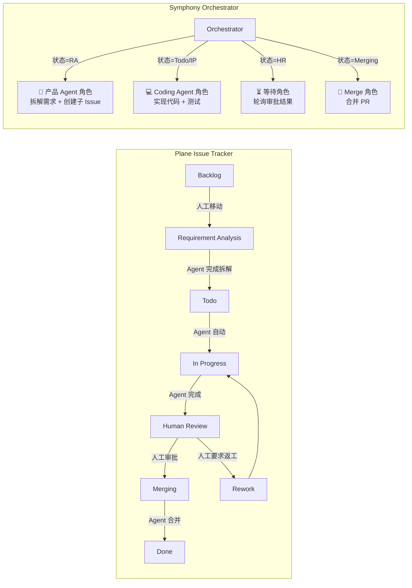
```mermaid
graph LR
    subgraph "Plane Issue Tracker"
        B[Backlog] -->|人工移动| RA[Requirement Analysis]
        RA -->|Agent 完成拆解| T[Todo]
        T -->|Agent 自动| IP[In Progress]
        IP -->|Agent 完成| HR[Human Review]
        HR -->|人工审批| M[Merging]
        HR -->|人工要求返工| RW[Rework]
        M -->|Agent 合并| D[Done]
        RW --> IP
    end

    subgraph "Symphony Orchestrator"
        O[Orchestrator] -->|状态=RA| PA["🎯 产品 Agent 角色<br/>拆解需求 + 创建子 Issue"]
        O -->|状态=Todo/IP| CA["💻 Coding Agent 角色<br/>实现代码 + 测试"]
        O -->|状态=HR| WA["⏳ 等待角色<br/>轮询审批结果"]
        O -->|状态=Merging| MA["🚀 Merge 角色<br/>合并 PR"]
    end
```

#### 3A.1 自定义状态机

```yaml
# WORKFLOW.md 前置配置
tracker:
  kind: plane                          # 需要实现 Plane Adapter
  api_key: $PLANE_API_KEY
  project_slug: "shadowfolk"
  active_states:
    - Requirement Analysis              # 🆕 新增：需求分析阶段
    - Todo
    - In Progress
    - Merging
    - Rework
  terminal_states:
    - Done
    - Closed
    - Cancelled
```

#### 3A.2 WORKFLOW.md Prompt 中的多角色路由

```liquid
You are working on a Plane ticket `{{ issue.identifier }}`

Issue context:
Identifier: {{ issue.identifier }}
Title: {{ issue.title }}
Current status: {{ issue.state }}
Description:

{{ issue.description }}

No description provided.


## 角色路由：根据当前状态切换你的角色和行为


## ====== 🎯 角色：产品经理 Agent ======

你现在是一个资深产品经理。你的任务不是写代码，而是：

1. **理解需求意图**
   - 分析 Issue 标题 "{{ issue.title }}" 的含义
   - 如果描述为空，基于项目上下文和标题推断需求范围
   - 阅读 shadowfolk 项目的 README 和现有代码结构，理解项目定位

2. **需求拆解**
   - 将模糊需求拆解为 3-7 个具体的、可执行的子任务
   - 每个子任务需要有：
     - 清晰的标题
     - 详细的描述（包含技术方向）
     - 验收标准（Acceptance Criteria）
     - 优先级排序
     - 依赖关系（blockedBy）

3. **输出格式**
   - 在当前 Issue 的 Workpad 评论中写下完整的需求分析文档
   - 通过 Plane API 创建子 Issue（每个子任务一个）
   - 子 Issue 状态设为 Todo，关联到父 Issue
   - 设置合理的 blockedBy 依赖关系

4. **完成后**
   - 更新父 Issue 的描述，补充需求概述
   - 将父 Issue 状态更新为 `Todo`
   - 此时 Symphony 会在下一个 tick 中：
     a. 发现父 Issue 变为 Todo → 等待子 Issue 完成
     b. 发现子 Issue 为 Todo → 逐个 dispatch 给 Coding Agent


## ====== 💻 角色：编码工程师 Agent ======

你现在是一个资深全栈工程师。

1. 如果状态是 Todo，立即移到 In Progress
2. 阅读 Issue 描述和验收标准
3. 在 Workpad 中制定技术方案和实现计划
4. 实现代码、编写测试
5. 创建 PR 并确保 CI 通过
6. 完成后移到 Human Review

（此处复用 Symphony 标准的 Step 1/2 流程）


## ====== 👀 角色：等待审查 ======

1. 不做代码修改
2. 轮询 PR 反馈
3. 如有反馈需要处理，移到 Rework


## ====== 🔧 角色：返工工程师 Agent ======

1. 阅读所有审查反馈
2. 按反馈修改代码
3. 更新 PR
4. 重新移到 Human Review


## ====== 🚀 角色：合并 Agent ======

执行 land 技能，合并 PR，移到 Done


```

#### 3A.3 完整流程走一遍

以你的 shadowfolk 工作区管理系统为例，从头到尾是这样的：

```
时间线    状态变化                      Symphony 做了什么
──────    ──────────                    ──────────────────
T=0       人工将 Issue 从 Backlog       （触发条件：人手动把 Issue 移到
          移到 "Requirement Analysis"    Requirement Analysis）

T=30s     Symphony tick 发现 Issue       Orchestrator fetch → 发现状态在
          状态 = Requirement Analysis    active_states 中 → dispatch Worker

T=31s     Agent 启动                     AgentRunner 创建 workspace →
          (角色: 产品经理)               clone shadowfolk 仓库 →
                                         渲染 Prompt（命中 RA 分支）

T=31s     Turn 1: 需求分析               Agent 阅读项目代码结构 →
~5min                                    理解 "工作区管理系统" 的含义 →
                                         在 Workpad 写下需求文档：

                                         需求分析结果：
                                         ┌──────────────────────────────┐
                                         │ 工作区管理系统 拆解为：       │
                                         │                              │
                                         │ SF-201: 工作区数据模型设计    │
                                         │   - 定义 Workspace 实体       │
                                         │   - 数据库 migration          │
                                         │   - 优先级: P1               │
                                         │                              │
                                         │ SF-202: 工作区 CRUD API       │
                                         │   - REST 接口实现             │
                                         │   - 依赖: SF-201             │
                                         │   - 优先级: P2               │
                                         │                              │
                                         │ SF-203: 工作区前端页面        │
                                         │   - 列表 + 创建 + 编辑       │
                                         │   - 依赖: SF-202             │
                                         │   - 优先级: P3               │
                                         │                              │
                                         │ SF-204: 工作区权限控制        │
                                         │   - RBAC 集成                │
                                         │   - 依赖: SF-201             │
                                         │   - 优先级: P2               │
                                         │                              │
                                         │ SF-205: 工作区搜索与筛选      │
                                         │   - 搜索 + 标签筛选          │
                                         │   - 依赖: SF-202             │
                                         │   - 优先级: P3               │
                                         └──────────────────────────────┘

          Turn 2: 创建子 Issue           Agent 通过 Plane API 创建 5 个子 Issue →
                                         设置 blockedBy 依赖关系 →
                                         更新父 Issue 描述 →
                                         将父 Issue 状态改为 Todo

T=6min    父 Issue 状态 = Todo           Symphony 下次 tick 发现：
                                         - 父 Issue SF-200 = Todo，但有 blocker
                                           （子 Issue 未完成）→ 不 dispatch
                                         - SF-201 = Todo，无 blocker → dispatch!

T=7min    SF-201 Agent 启动              AgentRunner 创建 SF-201 workspace →
          (角色: 编码工程师)              clone shadowfolk →
                                         渲染 Prompt（命中 In Progress 分支）→
                                         实现数据模型 + migration

T=20min   SF-201 完成 → Human Review     Agent 提交 PR → 移到 Human Review

T=20min   SF-202 的 blocker 解除         Symphony tick：
+30s      SF-202 dispatch                SF-201 完成 → SF-202 blocker 解除 →
                                         dispatch SF-202

T=21min   SF-204 也被 dispatch           SF-204 依赖 SF-201（已完成）→
                                         blocker 解除 → dispatch
                                         （和 SF-202 并行执行！）

...       （持续循环）                    所有子 Issue 逐步完成

T=2h      所有子 Issue = Done            父 Issue SF-200 的所有 blocker 解除 →
                                         人工审查 → Done
```

### 方案 B：多实例级联（复杂度高，适合需要不同模型的场景）

**核心思路**：运行多个 Symphony 实例，每个实例使用不同的 WORKFLOW.md（不同的 Prompt = 不同的角色），通过 Issue 状态机串联。

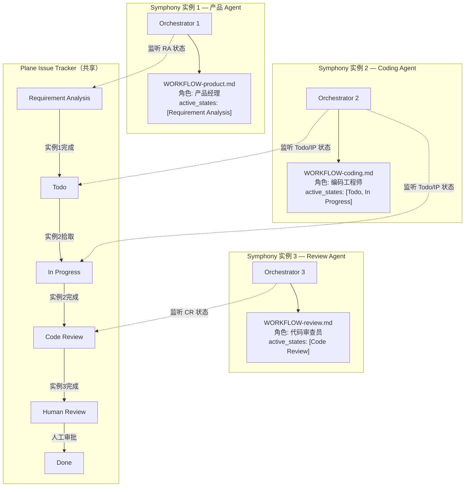
```mermaid
graph TD
    subgraph "Symphony 实例 1 — 产品 Agent"
        S1[Orchestrator 1]
        W1["WORKFLOW-product.md<br/>角色: 产品经理<br/>active_states: [Requirement Analysis]"]
        S1 --> W1
    end

    subgraph "Symphony 实例 2 — Coding Agent"
        S2[Orchestrator 2]
        W2["WORKFLOW-coding.md<br/>角色: 编码工程师<br/>active_states: [Todo, In Progress]"]
        S2 --> W2
    end

    subgraph "Symphony 实例 3 — Review Agent"
        S3[Orchestrator 3]
        W3["WORKFLOW-review.md<br/>角色: 代码审查员<br/>active_states: [Code Review]"]
        S3 --> W3
    end

    subgraph "Plane Issue Tracker（共享）"
        RA[Requirement Analysis] -->|实例1完成| T[Todo]
        T -->|实例2拾取| IP[In Progress]
        IP -->|实例2完成| CR[Code Review]
        CR -->|实例3完成| HR[Human Review]
        HR -->|人工审批| D[Done]
    end

    S1 -.->|监听 RA 状态| RA
    S2 -.->|监听 Todo/IP 状态| T
    S2 -.->|监听 Todo/IP 状态| IP
    S3 -.->|监听 CR 状态| CR
```

#### 方案 B 的优势

| 优势 | 说明 |
|------|------|
| **不同模型** | 产品 Agent 可用推理能力强的模型（如 o3），Coding Agent 用编码擅长的模型（如 codex） |
| **不同沙箱策略** | 产品 Agent 只需要读权限，Coding Agent 需要写权限 |
| **独立扩缩容** | 可以给 Coding Agent 更多并发，产品 Agent 只需 1 个 |
| **独立故障域** | 一个实例崩溃不影响其他 |

#### 方案 B 的劣势

| 劣势 | 说明 |
|------|------|
| **运维复杂** | 需要管理 3 个独立进程 |
| **状态协调** | 需要确保状态名称在所有实例之间一致 |
| **Workspace 冲突** | 多实例可能操作同一个 Issue 的 Workspace（需要不同的 workspace root） |

## 4. 推荐方案详细设计（方案 A）

### 4.1 需要开发的扩展组件

```
优先级 1（必须）：
├── Plane Tracker Adapter       # 替换 Linear，实现 Plane GraphQL/REST API
│   ├── fetch_candidate_issues()
│   ├── fetch_issue_states_by_ids()
│   └── fetch_issues_by_states()
│
├── Plane DynamicTool           # 让 Agent 能通过工具调用 Plane API
│   └── plane_graphql / plane_rest
│
└── 自定义 WORKFLOW.md          # 多角色 Prompt + shadowfolk 专用配置

优先级 2（可选增强）：
├── 子 Issue 自动创建工具       # 封装"创建子 Issue + 设置依赖"的工具
└── 自动代码审查集成            # Review Agent 调用静态分析工具
```

### 4.2 WORKFLOW.md 完整配置示例

```yaml
---
tracker:
  kind: plane
  endpoint: https://api.plane.so/v1
  api_key: $PLANE_API_KEY
  project_slug: "shadowfolk"
  active_states:
    - Requirement Analysis
    - Todo
    - In Progress
    - Code Review
    - Merging
    - Rework
  terminal_states:
    - Done
    - Closed
    - Cancelled

polling:
  interval_ms: 15000

workspace:
  root: ~/code/shadowfolk-workspaces

hooks:
  after_create: |
    git clone --depth 1 git@github.com:yourorg/shadowfolk.git .
    npm install
  before_run: |
    git fetch origin main
    git checkout main
    git pull origin main

agent:
  max_concurrent_agents: 5
  max_turns: 20
  max_retry_backoff_ms: 300000
  max_concurrent_agents_by_state:
    requirement analysis: 1          # 需求分析同一时间只跑 1 个
    todo: 3                           # 编码可以并行 3 个
    in progress: 3
    code review: 2                    # 审查可以并行 2 个

codex:
  command: codex app-server
  approval_policy: never
  thread_sandbox: workspace-write
---

（这里是 Prompt 模板正文，包含前面 3A.2 中的多角色路由逻辑）
```

### 4.3 图片中 Prompt 构建流程在本场景的应用

结合图片中展示的 Prompt 构建流程（WORKFLOW.md 模板 → Issue 数据填充 → Solid 渲染 → JSON-RPC 发送），以 SF-201 子 Issue 为例：

```
                    Prompt 构建流程（以 SF-201 为例）
┌────────────────────────────────────────────────────────┐
│                                                        │
│  ① WORKFLOW.md 的 Markdown 正文 (模板)                  │
│  ┌──────────────────────────────────────────────────┐  │
│  │ You are working on a Plane ticket                │  │
│  │ `{{ issue.identifier }}`                         │  │
│  │                                                  │  │
│  │ Issue context:                                   │  │
│  │ Title: {{ issue.title }}                         │  │
│  │ Status: {{ issue.state }}                        │  │
│  │ Description: {{ issue.description }}             │  │
│  │                                                  │  │
│  │             │  │
│  │   ## 角色：编码工程师 Agent                       │  │
│  │   ...                                            │  │
│  │                                       │  │
│  └──────────────────────────────────────────────────┘  │
│                          │                             │
│  ② 从 Plane API 拉到的 Issue 数据                      │
│  ┌──────────────────────────────────────────────────┐  │
│  │ identifier: "SF-201"                             │  │
│  │ title: "工作区数据模型设计"                        │  │
│  │ description: "定义 Workspace 实体，包含名称、     │  │
│  │   所有者、创建时间等字段。编写数据库 migration。"  │  │
│  │ state: "Todo"                                    │  │
│  │ labels: ["backend", "database"]                  │  │
│  │ blocked_by: []   ← SF-201 无阻塞                │  │
│  └──────────────────────────────────────────────────┘  │
│                          │                             │
│  ③ PromptBuilder 用 Solid (Liquid 引擎) 渲染            │
│                          ▼                             │
│  ┌──────────────────────────────────────────────────┐  │
│  │ You are working on a Plane ticket `SF-201`       │  │
│  │                                                  │  │
│  │ Issue context:                                   │  │
│  │ Title: 工作区数据模型设计                         │  │
│  │ Status: Todo                                     │  │
│  │ Description: 定义 Workspace 实体，包含名称、      │  │
│  │   所有者、创建时间等字段。编写数据库 migration。   │  │
│  │                                                  │  │
│  │ ## 角色：编码工程师 Agent                         │  │
│  │ 1. 立即将状态移到 In Progress                     │  │
│  │ 2. 阅读需求，制定技术方案                         │  │
│  │ 3. 实现代码 + 测试                                │  │
│  │ 4. 创建 PR，移到 Human Review                     │  │
│  └──────────────────────────────────────────────────┘  │
│                          │                             │
│  ④ 通过 JSON-RPC turn/start 发给 Codex CLI              │
│  ┌──────────────────────────────────────────────────┐  │
│  │ {"method": "turn/start", "params": {             │  │
│  │     "input": [{"type":"text",                    │  │
│  │       "text":"<渲染后的prompt>"}],                │  │
│  │     "title": "SF-201: 工作区数据模型设计",        │  │
│  │     ...                                          │  │
│  │ }}                                               │  │
│  └──────────────────────────────────────────────────┘  │
└────────────────────────────────────────────────────────┘
```

## 5. 关键设计决策与权衡

### 5.1 为什么推荐"单实例 + 状态路由"而非"多 Agent 实例"

| 考量 | 单实例 + 状态路由 | 多实例级联 |
|------|------------------|-----------|
| **运维复杂度** | ⭐ 低 — 一个进程 | ⭐⭐⭐ 高 — 多进程协调 |
| **Workspace 管理** | ⭐ 简单 — 每个 Issue 一个 workspace | ⭐⭐⭐ 复杂 — 需避免 workspace 冲突 |
| **状态一致性** | ⭐ 天然一致 — 单一 Orchestrator | ⭐⭐ 需要约定 — 多个 Orchestrator 读同一个 Tracker |
| **角色切换灵活性** | ⭐⭐ 通过 Prompt 模板切换 | ⭐ 每个实例固定角色 |
| **模型差异化** | ⭐⭐ 只能用同一个 Codex 配置 | ⭐ 每个实例可用不同模型 |
| **故障隔离** | ⭐⭐ 所有角色共享一个进程 | ⭐ 完全隔离 |

**推荐单实例的核心理由**：Symphony 的 Prompt 模板系统足够强大——通过 Liquid 的 `` 条件分支，同一个 Agent 完全可以在不同状态下表现出截然不同的行为。这比运维多个 Symphony 实例简单得多。

### 5.2 Backlog → Requirement Analysis 的人工触发

```
为什么不能自动从 Backlog 开始？

Symphony 的设计哲学是"人类管理工作，Agent 执行工作"：
- Backlog 中的 Issue 代表"可能要做的事"
- 只有人类决定"是的，这个要做了"，才将其移到活跃状态
- 这是一个有意的安全门控——防止 Agent 自作主张执行未经审批的工作

你的设计：
  Backlog → [人工移动] → Requirement Analysis → [Agent 自动] → Todo → ...

这个人工触发点是必要的：
1. 确认"这个功能确实要做"
2. 确认时机合适（不会与其他工作冲突）
3. 提供初始方向（即使 description 为空，标题本身是人的意图表达）
```

### 5.3 需求为空时的 Agent 策略

```
描述为空怎么办？

这实际上是你的场景中最有价值的部分——
"产品 Agent" 的核心能力就是从模糊输入中产出结构化需求。

Agent 策略：
1. 标题解析: "实现工作区管理系统" → 关键词: 工作区、管理、系统
2. 项目上下文: 阅读 shadowfolk 的 README、目录结构、现有数据模型
3. 行业知识: 结合 LLM 对"工作区管理"的理解
4. 输出: 结构化的子 Issue + 完整描述

这就是为什么 Requirement Analysis 阶段的 Prompt 需要特别设计：
- 明确告诉 Agent "描述可能为空，你需要自己推断"
- 给 Agent 足够的项目上下文获取指令
- 定义输出格式（子 Issue 的结构）
```

## 6. 总结：端到端流程全景图

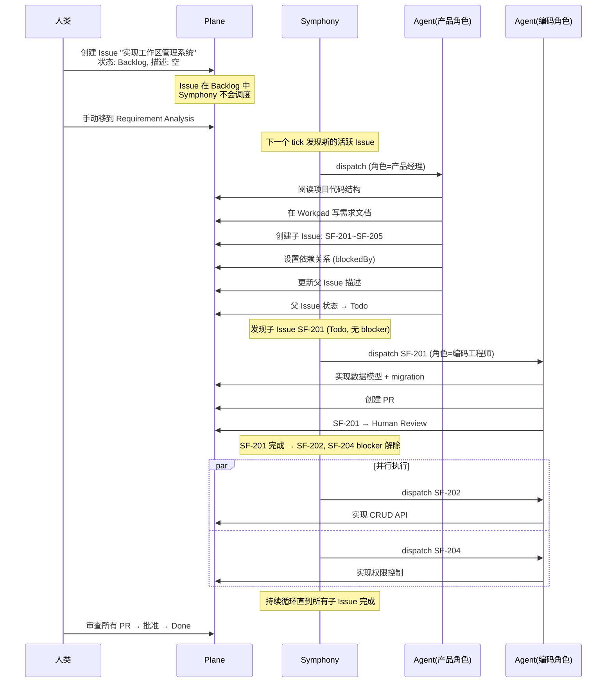
```mermaid
sequenceDiagram
    participant H as 人类
    participant P as Plane
    participant S as Symphony
    participant PA as Agent(产品角色)
    participant CA as Agent(编码角色)

    H->>P: 创建 Issue "实现工作区管理系统"<br/>状态: Backlog, 描述: 空
    Note over P: Issue 在 Backlog 中<br/>Symphony 不会调度

    H->>P: 手动移到 Requirement Analysis
    Note over S: 下一个 tick 发现新的活跃 Issue

    S->>PA: dispatch (角色=产品经理)
    PA->>P: 阅读项目代码结构
    PA->>P: 在 Workpad 写需求文档
    PA->>P: 创建子 Issue: SF-201~SF-205
    PA->>P: 设置依赖关系 (blockedBy)
    PA->>P: 更新父 Issue 描述
    PA->>P: 父 Issue 状态 → Todo

    Note over S: 发现子 Issue SF-201 (Todo, 无 blocker)

    S->>CA: dispatch SF-201 (角色=编码工程师)
    CA->>P: 实现数据模型 + migration
    CA->>P: 创建 PR
    CA->>P: SF-201 → Human Review

    Note over S: SF-201 完成 → SF-202, SF-204 blocker 解除

    par 并行执行
        S->>CA: dispatch SF-202
        CA->>P: 实现 CRUD API
    and
        S->>CA: dispatch SF-204
        CA->>P: 实现权限控制
    end

    Note over S: 持续循环直到所有子 Issue 完成

    H->>P: 审查所有 PR → 批准 → Done
```

这就是 Symphony + 自定义状态机 + 多角色 Prompt 的完整设计方案。核心要点：

1. **Symphony 是调度器，不是 Agent**——它不关心 Agent "是什么角色"，只关心 Issue 在什么状态、是否该 dispatch
2. **角色通过 Prompt 模板实现**——同一个 Codex Agent 在 `Requirement Analysis` 状态收到"产品经理 Prompt"，在 `In Progress` 状态收到"编码工程师 Prompt"
3. **多 Agent 协作通过 Issue 依赖实现**——子 Issue 的 `blockedBy` 关系天然形成了任务编排图
4. **人类保持控制权**——Backlog → RA 的触发、Human Review 的审批，都是人类的决策点
